# Prototype → App: UI/UX gap comparison

**Written 2026-08-25.** A catalogue of everything the demo prototype
(`loftyprojectboard/index.html`, also served in this repo as `/prototype.html`) does that the
React app (`app/src`) does not do yet — with enough detail against each item that it can be
implemented later without re-opening the prototype source.

A readable version with the screenshots inline is published at
https://claude.ai/code/artifact/4f096b79-6608-47ca-9259-a6d030f651ce — show that one to
people; edit this file.

**Revision 2 — 25 Aug 2026, later the same day.** Two things landed after the first
version, and this revision folds both in:

1. **The app moved.** PR #37 merged (commits `dadf7c9`…`4867f85`, migrations `0039`–`0044`):
   stage moves with drag-and-drop, real comments, `property_defs` as a table with a Setup
   screen, project-page editing, address history, project lifecycle stage, SharePoint
   columns, per-lot split numbers. §1.5 is the delta ledger; every affected entry carries
   an **Update (rev 2)** paragraph, and the summary table shows current classes.
2. **Amber answered the ten questions** (plus a lifecycle-stages note). §1.6 records the
   decisions and what each unblocks; §5's questions are now marked answered.

One caution for readers: `HANDOFF.md` has **not** been updated for PR #37 — its "most
recent session" section still describes the session before it. Where this document cites
HANDOFF for state of play, the app is now ahead of it.

**Screenshots.** Every prototype surface referenced here is captured in
`docs/comparison-screenshots/` (33 PNGs, taken from the live prototype at 1440×900 with the
prototype banner dismissed, signed in as *Demo Admin* unless noted). The app side could not
be screenshotted in this environment — the app requires `VITE_SUPABASE_*` credentials and
shows the "Not configured" sign-in screen without them, and stubbing around auth just for
pictures would misrepresent it — so the app side is described with exact `file:line`
references instead. Every one of those was taken from the current source on this branch.

---

## 1. How to read this document

### 1.1 This is a translation, not a checklist

The prototype was finished in July 2026. The schema moved on in August. Several things the
prototype displays are built on vocabulary the database has since replaced, so **porting any
prototype feature verbatim would reintroduce decisions that were deliberately reversed.**
Every gap below is stated in current vocabulary; where the prototype's version used old
vocabulary, the entry says what translates and what doesn't.

The translation table (current model per `schema-plan.md` and migration `0035`):

| The prototype has | The current model has | What it means for porting |
|---|---|---|
| **8 stages** (Sales & acquisition → Handover & maintenance), `index.html:4947-4956` | **5 lifecycle phases**: Acquisition & Development, Pre-construction, Construction, Handover & Maintenance, Closed (`app/src/data/types.ts:792-798`) | Anything keyed by stage (board columns, colour ramp, gantt bands, template phases) re-maps to 5 top-level phases; finer stages live in **nested pipelines** (`pipelines.pipeline_parent_stage_id`) |
| **Health**: `on-track / at-risk / stale`, set on the job | **`record_status`** (7 values, set by a person: on_track, at_risk, behind_schedule, on_hold, completed, cancelled, archived); **derived health is deliberately parked** until "what makes a job at risk" is decided (`HANDOFF.md:1060-1064`, `types.ts:172-181`) | Status pills translate directly. Anything *computed* (overdue flags, needs-attention, stalled) is blocked on the at-risk decision |
| **Owner**: 11 hardcoded departments | **`teams`** lookup table, 15 rows, 12 active (`types.ts:482-498`); jobs hold a team slug | Translates directly |
| **Assignee**: 16 hardcoded names on every job | **No assignee column on jobs.** `profiles` (47 real people) exists, but nothing on a job names a person yet — which is why every "Assigned to" in the app is a `{{profiles.full_name}}` token | Every assignee-driven feature (avatars, member grouping/filtering, "my jobs", mentions fan-out) is blocked on an assignment model, not on UI work |
| **Roles**: team_member / manager / admin / super_admin, plus a 6-role, 6-scope grants grid | **`permission_level` ladder**: viewer < user < manager < admin < superadmin (`types.ts:414`); scopes none/own/team/all; `team_hierarchy` and `division` scopes are **gone** | The prototype's *pattern* (capability checks at every mutation, role-shaped UI) carried over as `can()`; the specific roles and grid did not |
| **Division** on projects; **type** on jobs | Both gone. `project_type` lives on the project only | Division filters/columns don't come back; job-level type displays read from the parent project |
| `PHASE_EXPECTED_DAYS` hardcoded (`index.html:9079-9088`), fallback 14 | `pipeline_stage_expected_days`, **nullable, no default, meant to be editable** (decision answered 23 Aug, `HANDOFF.md:1065-1078`) | Overdue = `days > expected` survives as a formula, but only fires where an expected value has been set; the `?? 14` fallback was deliberately removed from the app (`JobsPage.tsx:262-264`) |
| Hardcoded "today" `2026-07-17`, deterministic fake timestamps | Real `created_at` etc. | Nothing to port; noted so nobody copies `deterministicTime()` |
| Projects derived from suburbs, numbered `1201+` | Real projects with natural keys, built by the Phase B import | Numbering/preview features re-derive from the real key scheme |

### 1.2 Readiness classes

Every gap carries exactly one class. The classes come from the project's own sequencing
(`HANDOFF.md:1003-1052`: spine review → Phase B import → presentation UI → go-live):

- **A — Ready now.** Pure presentation/interaction work; no missing data, no open decision.
  (HANDOFF's caveat still applies: presentation work done before the import is designed
  against empty boards. A-class means *possible* now, not necessarily *best* now.)
- **B — After Phase B.** Worth building only against real rows (~200 jobs): layouts, colour,
  grouping, density, virtualisation all need data to judge.
- **C — Blocked on missing data/wiring.** A table, column, or repository method doesn't
  exist yet: `property_defs`, `pipeline_stage_tasks`, job-level comments/activity wiring,
  an assignee model, project address/date binding. The UI part is often small once the data
  exists; the entry says exactly what's missing.
- **D — Blocked on a business decision.** Lofty has to answer something first. The entry
  names the decision (most are already listed in `HANDOFF.md:1056-1236`).

### 1.3 Superseded — do not port

These exist in the prototype and should **not** appear in any gap list. Recorded so they
don't get "rediscovered":

- **The user/role switcher and demo accounts** (`index.html:6233-6258`) — replaced by real
  Entra sign-in + `profiles.permission`; the app's demo switcher was already removed
  (`PermissionProvider.tsx:14-21`).
- **The "Dummy data" badge and prototype warning banner** — the app is real.
- **The 8-step colour ramp as-is** — the *concept* (two hue families, office/site, lightness
  = progression) survives (see G5); the 8 specific steps keyed to 8 stages do not.
- **The 3-value health enum**, `PHASE_EXPECTED_DAYS` constants, and the `?? 14` fallback.
- **The 36 invented template checkpoints** (`index.html:9212-9221`) and **11 invented
  property definitions** (`index.html:7757-7769`) — both were carried into the app once and
  deliberately deleted (`HANDOFF.md:158-183`); nothing gets seeded from the prototype's map.
- **Division**, **buildStage as a job column**, **job-level type**.
- **The six-role permission grid** with `team_hierarchy`/`division` scopes.
- **Suburb-derived projects and `1201+` numbering** (`index.html:5869-5922`).
- **Inferred data displays**: the "Requested by" requester guessed from the wording of the
  blocker text (`deriveRequester`, `index.html:6219-6229`), and activity attribution spread
  across departments a job "passed through" (`index.html:6187-6216`). Both violate the
  "never fill a gap with a plausible value" rule that now binds this repo.
- **The MutationObserver keyboard retrofit** and the 125 `.vibe-*` CSS classes — replaced by
  real Vibe React components (`react-migration.md:65-71`).
- **Native `alert()`/`confirm()`** in Admin — the app's `DeactivateDialog` modal is the
  pattern.
- **"+ New job" in the global toolbar** — the app deliberately creates jobs only from the
  project screen (`JobsPage.tsx:143-150`); a return of template-based creation is G31, but
  the *placement* decision stands.

### 1.4 Where-to-find-it blocks

Every gap ends with a block like:

```
Prototype: loftyprojectboard/index.html:6874-7001 (renderKanban)
App today: app/src/pages/JobsPage.tsx:185-217 (Board view) — no drag handlers exist
```

Paths are from each repo's root. Line numbers are correct on 2026-08-25; the function or
component name is included so the reference survives drift. Both codebases are mapped in
Appendix A so you can navigate without re-deriving structure.

### 1.5 What PR #37 changed (rev 2 delta ledger)

Merged the same day as revision 1, PR #37 (+3,004/−142 across 28 app/doc files, migrations
`0039`–`0044`, two new components) closed or reshaped a slice of this catalogue. Verified
against source on 25 Aug:

**Now real:**

| Landed | Where | Gaps affected |
|---|---|---|
| **Stage moves, both gestures**: board drag (native HTML5, manager+, Stage grouping only, backward drops refused *during* the drag), a forward-only picker in the drawer and on the project page, one confirmation modal naming from→to and warning on phase skips | `JobsPage.tsx:66,217-256`, `MoveStageDialog.tsx`, `moveJobStage`/`moveProjectStage` (`supabaseRepository.ts:994-1026`), DB guards in `0038`/`0039` | G7 largely built · G16 partially |
| **Comments, read + write**: `CommentsPanel` on the job drawer and project page; author stamped by trigger; newest comment is the record's "Latest update" | `CommentsPanel.tsx`, `listComments`/`addComment` (`supabaseRepository.ts:680-712`) | G18 partially · G6, G46 unblocked |
| **`property_defs` is a table with a screen**: Setup → Properties creates, deletes, and toggles `required`; superadmin-gated in the app and by policy; ships empty (nothing seeded, by design) | `0043`, `SetupPage.tsx:109-350`, four repository methods | G42 largely built · G17 narrows to `property_values` |
| **Dictionary edits persist** to `dictionary_overrides` (overrides, not a copy) | `0044`, `DictionaryPage.tsx:78-93` | closes rev 1's "edits live in page state" caveat |
| **Project page reads and writes**: address/suburb/council/type resolved; three dates + SharePoint URL editable via a patch-shaped `updateProject`; "+ Add another address" with a history table (`0042`'s trigger finally written) | `ProjectsPage.tsx:283-626`, `supabaseRepository.ts:1028-1090` | G29 largely built · G26's join **fixed** (`boardModel.ts:170-191` now populates addresses, dates, stage) |
| **Project lifecycle stage**, following its slowest job, forwards only, by trigger | `0039`, `0041`, shown at `ProjectsPage.tsx:405-422` | new since rev 1 |
| **SharePoint folder columns on both tables**; project page has the editable URL + "Open folder" link | `0040`, `ProjectsPage.tsx:459-485` | G24 drops to class A — job-side UI only |
| **Per-lot lot numbers and old job numbers** on the split, validated before any insert | `CreateDialogs.tsx`, `supabaseRepository.ts:846-973` | split flow richer |
| **Status pill hidden on cards** (`SHOW_STATUS_ON_CARDS = false`) — still shown in drawer and tables | `RecordCards.tsx:33` | G5/G6 note |

**Confirmed unchanged** (rev 1's claims stand): toolbar filters and the inert date control,
saved views, jobs/projects table sorting (SortableTable still Admin-only), drawer structure
(no tabs; milestones still an empty disabled list), assignee (token everywhere),
notifications, toasts, tooltips, dashboard, reports, templates, mentions UI, and a
human-readable activity feed (`activity_events` still has no writer — a stage move lands in
the forensic `activity_audit` only).

### 1.6 Decisions from Amber (25 Aug 2026)

The ten questions in §5, answered. Recorded here in full because several re-class gaps:

1. **At-risk / overdue** — defined per stage in an **SLA editor that lives in the
   Automations screen** (not built yet): stage name + **expected days in stage** + an
   **at-risk lead** (days before due at which the job flags at-risk). Overdue = in the
   stage longer than the set days. → G43's spec is final (and its home is Setup →
   Automations, not a new "Process" section); unblocks the D-side of G1, G13, G33, G36.
2. **Assignment** — jobs get an **assignee team and an assignee user property**, editable
   in the app; **projects get the same**; every job is **auto-assigned to Acquisition &
   Development on creation**. → A schema change (columns on jobs and projects), then every
   assignee-blocked item (G6 footer, G33 my-jobs, G47 Team-member filter, G18 mentions
   fan-out, G1 signals) becomes ordinary C-class wiring.
3. **AI dock** — **survives.** G23's decision resolves to yes; build once comments, SLAs
   and assignment give it real context to assemble.
4. **Notifications** — **this phase, in-app**: the dashboard surfaces and the header bell.
   Teams and email channels come later. → G1's channel question answered; G40's matrix
   narrows to in-app until then.
5. **Drag-and-drop** — "yes definitely". Confirmed the same day it shipped (§1.5); G7's
   remaining work is polish, not permission.
6. **Single-job creation / variations** — **variations will exist**; how is to be
   confirmed. G31 stays open on the details, not the principle.
7. **Push project→jobs** — applies to **what is set at project creation**; the push
   pattern survives for those properties. Details to firm up alongside 6. (G30)
8. **Waiting-on / change requests** — **yes, modelled as part of the variation request**;
   details TBC but "very important to keep". (G25 confirmed, tied to variations.)
9. **Preferences** — three layers, all wanted: **profile-backed defaults** (log in
   anywhere, land on your defaults), **session-persistent view state** (switch pages and
   come back — your view/filter choices hold), and **user-saved views** (beyond the three
   fixed tabs). → G39 grows from "make the selects real" to a small feature: profile
   preference storage + the existing URL state persisted per session + a saved-views table.
10. **Empty columns** — **keep them visible.** The app's current always-render behaviour
    is the decision; G11 closes.

**Lifecycle revision (Amber's note, recorded verbatim in substance).** The lifecycle needs
positions beyond today's five: a job or project can be **Completed**, and after **12
months** in Completed (or Cancelled) it moves to **Closed** — hidden by default, visible by
filter. **Cancelled** is its own position: a job can be cancelled without being complete.
Cancelled is **the only exception to forwards-only** — a cancelled job may be revived and
move backwards to a working stage. Once cancelled, its data is neither changed nor deleted,
but **no notifications, automations, or health alerts fire** for it.

Consequences worth flagging before Phase B (this is spine-level — the cheapest kind of
change to make now, per `HANDOFF.md`):
- `STAGE_NAMES` / the stage CHECKs (`types.ts:857-864`, `0035`, `0039`) hold five values
  ending in Closed; this revision implies **Completed, Closed, and Cancelled** as distinct
  positions with a 12-month automation between them.
- It **revises `schema-plan.md`'s recorded decision** that "cancellation is not a phase —
  it's a status"; the schema plan should log the reversal with this reasoning, not silently
  flip.
- The new forwards-only guards (`0039`'s `jobs_guard_linear_stage` /
  `projects_guard_linear_stage`, `0041`'s slowest-job clamp) need a **cancelled-revival
  carve-out**, and the 12-month Completed→Closed move is the first real automation
  (`pg_cron` is already installed).
- Every alerting feature in this document (G1, G33, G36) inherits the rule: **cancelled
  records are excluded from signals.**

> **Implemented, 26 Aug (`0045` + app, same branch):** the seven positions (Closed
> renamed Completed; Closed the archive; Cancelled with the revival carve-out), the
> guards, the `lifecycle_archive()` 12-month clock (pg_cron where present), cancelled
> jobs excluded from the project roll-up, the Cancel…/Revive to… controls in the stage
> picker, saved views hiding Closed by default, and the reversal logged in
> `schema-plan.md`. Also landed with it: assignee bound everywhere (the column existed
> since 0028 — cards, table, drawer and Team-member grouping now show real names), the
> Team filter matching membership per Amber's rule, modal padding fixed at its cause
> (`ModalBasicLayout` + body-level brand tokens for everything Vibe portals out of the
> ThemeProvider), and panels that cover the main area instead of the nav.

---

## 2. Gap catalogue

Summary (details follow; ✦ = has a screenshot; classes are **as of rev 2** — struck-through
entries were resolved between revisions):

| # | Gap | Class (rev 2) |
|---|---|---|
| G1 | Notifications: bell, badge, panel, seven derived signals ✦ | C — channels & thresholds decided |
| G2 | Toasts on mutations | A |
| G3 | Styled tooltips | A |
| G4 | Header search polish (focus-widen) | A |
| G5 | Phase-accent colour system on board columns ✦ | B |
| G6 | Job card content ✦ | C (mixed) |
| G7 | ~~Drag-and-drop between stage columns~~ | **Largely built** (PR #37) |
| G8 | Column drill-down pages ✦ | B |
| G9 | View header: title, filter sentence, breadcrumbs, collapse, drag hint ✦ | A |
| G10 | Mirror top scrollbar over wide views | A |
| G11 | ~~Empty-column policy (skip vs render)~~ | **Closed** — keep visible (Amber) |
| G12 | Jobs table: columns and sorting ✦ | A (partial C) |
| G13 | Real Gantt ✦ | B+C |
| G14 | Real calendar ✦ | C |
| G15 | Drawer: fullscreen toggle and tabs ✦ | A |
| G16 | Drawer: editable controls and the single write path | C — stage move built |
| G17 | All-properties view ✦ | C — now on `property_values` |
| G18 | Unified activity & comments feed with @mentions ✦ | C — comments built |
| G19 | In-drawer search and jump ✦ | A |
| G20 | Drawer polish: project chip, Esc two-step, focus, scroll preservation | A |
| G21 | Departments / handoff view ✦ | D |
| G22 | Scheduling checklists ✦ | D |
| G23 | "Ask" callout and AI dock ✦ | C — decided: it survives |
| G24 | Job file / SharePoint folder links | **A** — data ready, UI only |
| G25 | "Request changes" flow | D — confirmed, via variations |
| G26 | Project cards: progress, per-job lines ✦ | B — join fixed (PR #37) |
| G27 | Project table columns ✦ | B+C |
| G28 | Project Gantt and calendar ✦ | B — dates now editable |
| G29 | ~~Project detail editing~~ ✦ | **Largely built** (PR #37) |
| G30 | Push-to-jobs ✦ | D — narrowed to creation-set properties |
| G31 | Job creation from template with preview ✦ | D — variations TBC |
| G32 | New-project "what this creates" preview | A |
| G33 | Populated personal dashboard ✦ | C — all three blockers answered |
| G34 | Report KPIs: blocked, conflicts ✦ | C |
| G35 | Phase-coloured report bars | B |
| G36 | Leadership analytics: overruns, bottlenecks ✦ | C — SLA spec final |
| G37 | Printable job report ✦ | A |
| G38 | Clickable report rows | A |
| G39 | Preferences, view persistence, saved views ✦ | A+C — scope grew (Amber) |
| G40 | Settings: notification matrix persistence ✦ | C — in-app first |
| G41 | Template / milestone editing ✦ | D |
| G42 | ~~Property-definition editing~~ ✦ | **Largely built** (PR #37) |
| G43 | Stage SLA editor (in Setup → Automations) | A — spec final, the unlock |
| G44 | Team management UI ✦ | A |
| G45 | Permissions matrix, real ✦ | C |
| G46 | Date-range filter ✦ | C — comments give it a date |
| G47 | Additional filter fields | C — assignee model decided |
| G48 | Live-region announcements | A |

### Shell & chrome

---

#### G1 · Notifications — bell, badge, panel, seven derived signals — **C + D**

**Update (rev 3, 26 Aug): the bell and panel exist as a declared placeholder.** A header
bell (`NotificationsBell.tsx`) opens a panel naming the seven signals and what each waits
on — no badge, because there is no real count to show. The notification model (table,
triggers, read state) remains the C-class work.

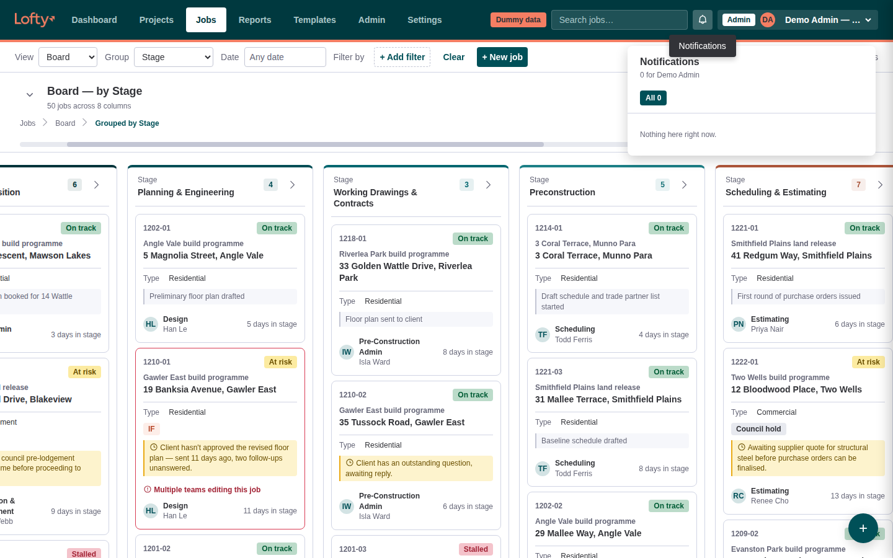

**Prototype.** A bell in the header with a red pill counter; clicking opens a 400px panel
anchored under the header with type-filter chips ("All 12 · Overdue 3 · Mentions 2 …") and
rows of icon + title + body + date; clicking a row opens that job's drawer; clicking outside
closes. Seven signal types, each **derived on read** from record state
(`buildNotifications`, `index.html:8816-8862`):

| Signal | Fires when | Title pattern |
|---|---|---|
| Overdue | `days > expected` on a job assigned to you | "1221-02 is 4 days over" |
| Stalled | status is stalled on your job | "…has stalled" |
| Change requests | job has a waiting-on text | "…is waiting on a response" |
| Blocked | a dependency parent hasn't cleared | "…is blocked" |
| Ownership | conflict flag set | "Two teams are editing …" |
| Mentions | any comment contains `@you` | "Marcus Webb mentioned you" |
| Incoming work | job sits in the phase before one your team owns | "…is heading to Estimating" |

The prototype's own comment says the real build would write trigger-generated rows with
per-user read state and per-channel fan-out rather than deriving on read
(`index.html:8804-8805`).

**App today.** Nothing — no bell, no panel, no notification model. The seven event types
already appear in the app in one place: the (inert) Settings notification matrix
(`SettingsPage.tsx:18-26`).

**To implement.**
- **D first**: most signals depend on open decisions — overdue needs stage SLAs *set*
  (nullable, none set today), stalled needs the at-risk/health definition
  (`HANDOFF.md:1060-1064`), incoming-work needs phase→team ownership, which Lofty answered
  "no lifecycle phase has an owning team" (`schema-plan.md:507-512`) — so that signal needs
  redefining against nested-pipeline ownership or dropping.
- **C**: mentions need job comments wired (G18); blocked needs dependencies wired (G6);
  change requests need a waiting-on model (G25); everything needs an assignee model.
- Storage: a `notifications` table written by triggers (pg_cron/pg_net are already
  installed for Phase C automations, `HANDOFF.md:1249-1253`), read through a new repository
  method — never derived in the client at 200-job scale.
- UI is the easy part: header `IconButton` + Vibe `Counter` (the one legitimate pill), a
  `Dialog`-anchored panel like `UserMenu` (`AppShell.tsx:50-107`), filter chips, row click →
  `/jobs/:jobNumber`.

```
Prototype: loftyprojectboard/index.html:8799-8918 (types, buildNotifications, panel, badge)
App today: absent. Header lives in app/src/shell/AppShell.tsx:266-300; the seven event
           names already exist at app/src/pages/SettingsPage.tsx:18-26
```

**Update (rev 2).** The D-side largely resolved: channels are decided (in-app — dashboard
surfaces + the header bell — this phase; Teams/email later, per Amber Q4), overdue and
at-risk thresholds are defined by the SLA spec (Q1: expected days + an at-risk lead per
stage), and the assignee model is decided (Q2). Mentions still need a UI (the
`comment_mentions` table already exists, `0032`), incoming-work still needs redefining
against nested-pipeline ownership, and per the lifecycle revision **cancelled records
never fire notifications**. Class is now plain C: build the table + triggers, then the
bell and panel.

---

#### G2 · Toasts on mutations — **A**

**Update (rev 3, 26 Aug): built, with the prototype's restraint.** A `ToastsProvider`
in the shell; fired only where success is otherwise invisible — job removed (the row is
gone), user saved/added/deactivated (the panel closes). Bottom-centre; errors stay
inline and verbatim. The create dialogs already confirm in place, so they don't toast.

**Prototype.** A Vibe-spec toast layer (bottom-centre, auto-dismiss 5s, positive/negative/
warning variants, optional action button, `vibeToast`, `index.html:10707-10731`). Fired in
exactly four places — push-comment, push-property ("Manager updated on 4 jobs."), post
comment, request changes — a deliberate "quiet by default" choice.

**App today.** No toast anywhere. Creating a project, creating jobs from a split, removing a
job, saving a user, deactivating — all complete silently (errors *are* surfaced, verbatim,
via `LoadProblem`/`Problem`; it's success that's silent).

**To implement.** `@vibe/core` ships `Toast` — already listed as wired-in in the prototype's
catalog audit and named as the replacement for `vibeToast()` (`react-migration.md:273`).
Add a small toast context in the shell; fire on the same class of events the prototype chose
(multi-record writes and things that happen off-screen), not on every save — the prototype's
restraint here was a decision, keep it.

```
Prototype: loftyprojectboard/index.html:10707-10731 (vibeToast), 4499-4557 (CSS)
App today: absent. Mutation call sites: app/src/components/CreateDialogs.tsx (create/split),
           app/src/pages/ProjectsPage.tsx:393-404 (remove job),
           app/src/components/UserDialogs.tsx (user save/deactivate)
```

---

#### G3 · Styled tooltips — **A**

**Update (rev 3, 26 Aug): deferred with a reason.** This Vibe build does not export
`Tooltip` through the core type bundle, so the sweep would mean untyped imports or a new
dependency. Native `title`/`aria-label` coverage stands; revisit on the next Vibe
upgrade.

**Prototype.** One shared tooltip element driven by `data-tooltip` attributes: styled,
viewport-clamped, flips below when there's no room, shows on **focus as well as hover**,
hides on Escape/scroll (`initTooltips`, `index.html:10737-10777`). Used on ~15 surfaces:
icon buttons, the bell, column expand chevrons, calendar entries, gantt bars, avatars.

**App today.** Native `title` attributes only (e.g. the collapsed nav rail,
`AppShell.tsx:145-149`) — unstyled, no touch, no keyboard.

**To implement.** Vibe's `Tooltip` component, already in the dependency. Sweep the places
that currently use `title` plus the icon-only buttons. One Vibe gotcha already documented:
Vibe's `title` prop renders a *visible* label — use `aria-label`/`Tooltip`, not `title`
(`HANDOFF.md:1330-1362`).

```
Prototype: loftyprojectboard/index.html:10737-10777 (initTooltips), 4559-4577 (CSS)
App today: native title= only, e.g. app/src/shell/AppShell.tsx:145-149
```

---

#### G4 · Header search polish — **A** (minor)

**Update (rev 3, 26 Aug): built** — the search widens on focus (320→420px, 150ms).

**Prototype.** The header search widens 220px → 280px on focus with a 150ms transition and
lightens its background (`index.html:415-434`).

**App today.** The search itself is **better** than the prototype's — same AND-across-terms
matching, plus it searches previous addresses with an explanatory notice
(`SearchProvider.tsx:47-51`, `HANDOFF.md:1282-1305`). Only the focus-widen affordance is
missing. Cosmetic; bundle with any header work.

```
Prototype: loftyprojectboard/index.html:415-434 (.header-search)
App today: app/src/shell/AppShell.tsx:266-300 (header), src/data/SearchProvider.tsx
```

### Jobs board

---

#### G5 · Phase-accent colour system on board columns — **B**

**Update (rev 3, 26 Aug): built.** The ramp is re-cut for the seven-position lifecycle in
`app/src/theme/accents.ts` — teal office pair, rust site pair, semantic ends (Completed
green, Closed grey, Cancelled negative ink) — applied per column as CSS custom properties
with an ink-on-tint count chip; non-stage groupings cycle the families. Judging the ramp
against populated columns (the B in the class) still deserves Amber's eye.

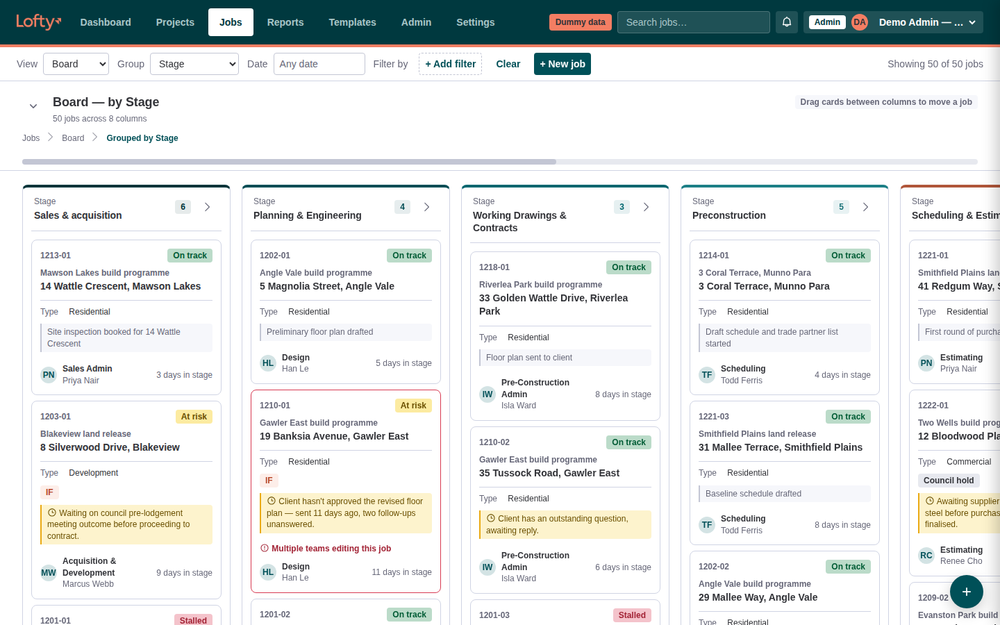

**Prototype.** The settled colour rule: **colour on containers encodes phase; colour on
records encodes health; never both on one element** (`prototype-handover.md:727-741`). Each
column carries a 4px top strip in its phase's colour; the count chip uses the phase
ink-on-tint pair; cards carry no phase colour at all. The ramp is two hue families — teal
for office-side phases, rust for site-side — with lightness carrying progression, so the
teal→rust crossing marks the handover to site and the ramp survives colour-vision
deficiency. Every strip/ink/tint triple clears 4.5:1 (`ACCENTS`/`STAGE_ACCENTS`,
`index.html:5699-5721`). Groupings without a fixed order (team, member) cycle through
`ACCENT_CYCLE` (`:5732-5741`); status grouping uses the health palette.

**App today.** Every board column shares one `border-top: 4px solid var(--primary-color)`
(`ui.css:159`); count chips are plain Vibe `Counter`s. No phase colour anywhere.

**To implement.** `react-migration.md:59` already says to port the ramp as a TS constant —
but it must be **re-cut for 5 phases**, which is a small design task, not a port: e.g. two
office steps (Acquisition & Development, Pre-construction) + two site steps (Construction,
Handover & Maintenance) + a neutral for Closed, re-verified for contrast. Apply as CSS
custom properties per column (`--col-accent/--col-ink/--col-tint`, the prototype's
`applyAccent` pattern, `:5744-5748`). Class B because judging the ramp needs populated
columns, and the re-cut deserves Amber's eye.

```
Prototype: loftyprojectboard/index.html:5699-5748 (ACCENTS, STAGE_ACCENTS, columnAccent,
           applyAccent), 1677-1698 (.column)
App today: app/src/components/ui.css:159 (single primary top border);
           columns render at app/src/pages/JobsPage.tsx:185-217
```

**Update (rev 2).** Cards no longer carry a status pill at all (`SHOW_STATUS_ON_CARDS =
false`, `RecordCards.tsx:33` — still shown in the drawer and tables). When the ramp lands,
revisit whether health returns to records per the containers-encode-phase /
records-encode-health rule; and note the lifecycle revision may add positions (Completed /
Closed / Cancelled), so cut the ramp against the final phase list, not today's five.

---

#### G6 · Job card content — **C (mixed)**

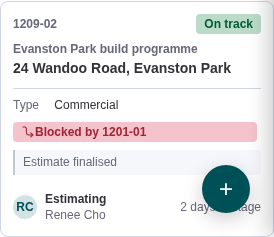

**Prototype card, top to bottom** (`index.html:6964-6987`, `.card` CSS `:1756-1774`):
job no + status pill · parent project name · address · divider · Stage/Type lines (the
Stage line is *dropped when it would repeat the column heading*, `:6959-6962`) · tags row
(`IF` tag gets the orange treatment) · dependency flag ("Blocked by 1201-01" red, or
"Depends on…" grey when cleared) · a **latest-update line on every card** — the amber
"waiting on" block when something's pending, otherwise the most recent activity entry in
quiet grey (`:6938-6942`) · conflict note ("Multiple teams editing this job") · footer with
assignee avatar + owning team + assignee name on the left, "N days in stage" on the right.

**App card today** (`RecordCards.tsx:18-91`): job number + status pill, address, Type
(token) + Stage, footer with team name + `{{profiles.full_name}}` token. Dashed border
marking unbound fields. No project name line, no tags, no dependency flag, no activity
line, no conflict note, no avatar, no days count on the card (days shows in table/gantt
only).

**To implement, per element:**
- *Project name line* — **A**: `BoardJob` already carries `projectNumber`; project name
  needs `boardModel.ts` to pass it through (it already joins projects).
- *Days in stage* — **A**: `daysInStage` is computed (`boardModel.ts:81`), just not shown
  on the card.
- *Tags row* — **C**: a `Tag` type exists (`types.ts`) and a tags table was built in
  `0024`–`0033`, but no repository method lists job tags and no UI reads them. Add
  `listJobTags`/embed to the seam first.
- *Dependency flag* — **C**: `TaskDependency` types and tables exist; same wiring gap.
  Note the prototype's dependency is job-level; the schema's is task-level — decide the
  roll-up (a job is "blocked" when any open task dependency is) before drawing the flag.
- *Latest activity line* — **C**: job activity isn't wired (`listActivity` currently serves
  profile audit only, `supabaseRepository.ts:539-558`).
- *Waiting-on amber block* — **D**: no waiting-on model (G25).
- *Conflict note* — **C/D**: concept-spec P0 requires flagging ownership conflicts
  (`concept-spec.md:81`), but nothing in the schema marks one yet.
- *Assignee avatar/name* — **C**: blocked on the assignee model (see §1.1).
Keep the card ≤300px and the "no invented initials" rule — the app removed fabricated
avatars on purpose.

```
Prototype: loftyprojectboard/index.html:6931-6987 (card assembly), 1756-1774 (.card)
App today: app/src/components/RecordCards.tsx:18-91 (JobCard);
           app/src/data/boardModel.ts:105-141 (what a card can currently know)
```

**Update (rev 2).** Three elements moved: the *latest-update line* is now feasible — the
newest comment is the record's "Latest update" (`CommentsPanel.tsx`), so a card line needs
only a per-card read of the newest comment; the *assignee footer* is decided (Q2: jobs and
projects get an assignee team + user, auto-assigned to Acquisition & Development on
creation) — a schema change, then ordinary wiring; and the *status pill* is currently
hidden on cards entirely (`RecordCards.tsx:33`). Waiting-on now rides the variations model
(Q8). Tags, dependency flag, and conflict remain as written.

---

#### G7 · Drag-and-drop between stage columns — **B**

**Prototype.** Cards drag between columns **only when grouped by phase and the role can
edit** (`index.html:6879`) — "the only grouping where the move has a meaning"
(`prototype-handover.md:328-330`). Native HTML5 DnD: dragged card at 40% opacity, target
column tinted with a 2px inset ring, drop moves the job, **resets days-in-stage to 0**, and
logs an activity entry naming both stages (`moveJobToStage`, `index.html:7210-7219`). A
grey hint pill in the view header says "Drag cards between columns to move a job".

**App today.** Cards are click-to-open only. No stage-move write exists on the repository.

**To implement.** `react-migration.md:334-336` already picked **dnd-kit** (keyboard-
accessible, which the prototype's native implementation is not — its drag was mouse-only).
Needs: a `moveJobToStage`-equivalent repository method writing `job_pipeline_positions` +
an activity row (single write path, G16); `can("user"/"manager")` gating consistent with
the RLS policy that must back it (a `can()` check without a policy is decoration, per
CLAUDE.md); the drag-hint pill and per-column drop styling. Enabled only in Stage grouping.
Class B: pointless to build against zero-row columns, and the interaction needs real
volumes to tune.

```
Prototype: loftyprojectboard/index.html:6889-6929 (drag handlers), 7210-7219
           (moveJobToStage), 6879 (gating)
App today: absent. Board columns app/src/pages/JobsPage.tsx:185-217; write path would be a
           new method in app/src/data/repository.ts
```

**Update (rev 2): largely built, the same day.** PR #37 shipped stage moves better than
the prototype's: board drag (native HTML5, `JobsPage.tsx:217-256`), enabled only when
grouped by Stage **and** `can("manager")` (`:66`); backward drops are refused *during* the
drag; a drop opens a **confirmation modal** naming from→to and warning when the move skips
phases (`MoveStageDialog.tsx:39-108`) — a step the prototype never had; the drawer and
project page carry a forward-only picker (`MoveStageControl`), which doubles as the
keyboard path; and the database enforces manager+ and forwards-only itself (`0038`,
`0039`), with `moveJobStage` surfacing an RLS-filtered zero-row update as a refusal
(`supabaseRepository.ts:994-1012`). Amber confirmed the feature the same day ("yes
definitely"). Remaining: the drag-hint pill in the view header (with G9); a
human-readable feed entry for moves (writes land only in the forensic `activity_audit` —
G18's `activity_events` writer covers this); and the lifecycle revision's
**cancelled-revival carve-out** in the forwards-only guards.

---

#### G8 · Column drill-down pages — **B**

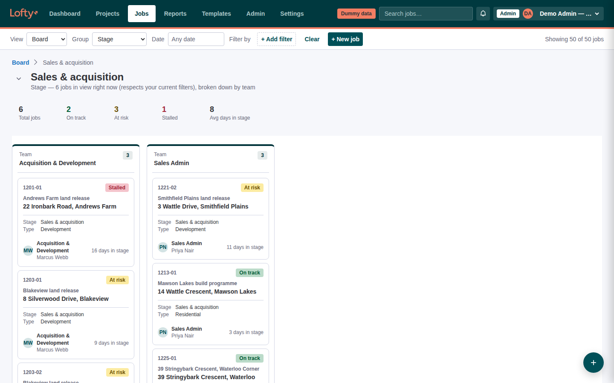
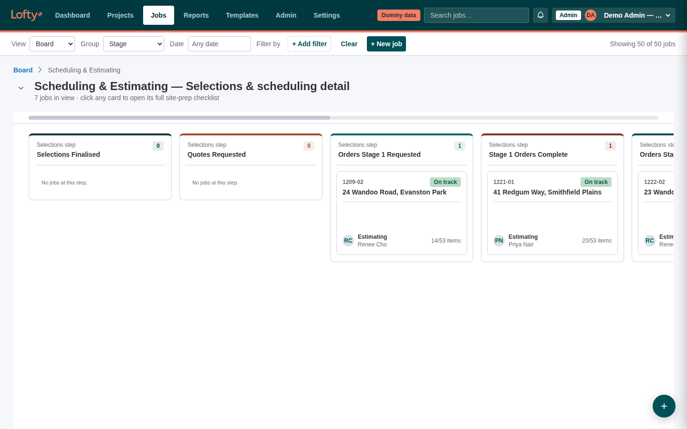

**Prototype.** Every column head carries a chevron ("See everything in Planning &
Engineering") that replaces the page with a drill-down: breadcrumb back to the board, five
stat tiles (Total / On track / At risk / Stalled / Avg days), then the column's jobs
**sub-grouped one level finer** — a phase breaks down by team, everything else breaks down
by phase — as a nested mini-board, or as a table if you drilled in from table view
(`openGroupDrilldown`, `index.html:7006-7103`). One special case: the Scheduling &
Estimating column drills into a mini-kanban whose columns are the nine selections
milestones, cards placed by how many steps they've completed (`renderSchedulingKanban`,
`:7153-7203`). Edits made in the drawer re-open the same drill-down in place rather than
dumping you back on the board (`refreshAfterJobChange`, `:10450-10457`).

**App today.** Column heads are static labels + counts. No drill-down surface.

**To implement.** As a route, not page state — `/jobs?group=stage&drill=Pre-construction`
extends the existing `useBoardParams` pattern so drill-downs are linkable (the app's URL
discipline is one of its advantages; keep it). Stat tiles = the existing `.stat-tile`
pattern from Reports. Sub-grouping reuses the board's grouping logic (`JobsPage.tsx:96-111`)
with a second key. The Scheduling special case translates to **the first nested pipeline**
— HANDOFF names Design's Working Drawings board as the first one to build
(`HANDOFF.md:1079-1114`) — same shape: a drill-down whose columns are a nested pipeline's
stages. Class B: it's a view over volume.

```
Prototype: loftyprojectboard/index.html:7006-7103 (openGroupDrilldown),
           7111-7151 (nested kanban), 7153-7203 (scheduling variant)
App today: absent. Column head renders at app/src/pages/JobsPage.tsx:185-217;
           URL state at app/src/data/useBoardParams.ts
```

---

#### G9 · View header — title, filter sentence, breadcrumbs, collapse, drag hint — **A**

**Prototype.** Above the board: "Board — by Stage", a sub-line "50 jobs across 8 columns ·
No filters applied — showing all jobs" (the filter clause comes from
`describeActiveFilters()`, which turns the active filter set into a human sentence,
`index.html:9410-9420`), a breadcrumb trail "Jobs › Board › Grouped by Stage", a collapse
toggle that shrinks the header to one line, and the drag-hint pill
(`renderViewHeader`, `:6822-6847`).

**App today.** "Jobs" + a count line per saved view (`JobsPage.tsx:125-132`) and the
toolbar's "Showing N of M jobs". No view/grouping echo, no filter sentence, no collapse.

**To implement.** Small component over existing state (`useBoardParams` already knows view,
group, filters). The filter sentence is worth porting exactly — it's also what makes the
printed report self-describing (G37). Collapse state → `localStorage` like the nav rail.

```
Prototype: loftyprojectboard/index.html:6822-6847 (renderViewHeader), 9410-9420
           (describeActiveFilters)
App today: app/src/pages/JobsPage.tsx:125-132 (page head), app/src/components/Toolbar.tsx
           (count display)
```

---

#### G10 · Mirror top scrollbar over wide views — **A**

**Prototype.** A drawn, sticky horizontal scrollbar sits **above** the board and gantts
(visible in the board screenshot under the view header), because native scrollbars are
overlay-only on macOS and the bottom of a wide board is a long way down. Draggable thumb
with pointer capture, click-track-to-jump, wheel-over-strip scrolls the view sideways,
two-way sync with the real scroller, auto-hides when not overflowing
(`attachTopScroll`, `index.html:6535-6643`).

**App today.** The board is a plain `overflow-x` container; you scroll it from its bottom
edge or with a trackpad.

**To implement.** Straight port as a small React component wrapping any `overflow-x` box
(board, future gantt). Keep it `aria-hidden` — it duplicates existing scrolling.

```
Prototype: loftyprojectboard/index.html:6535-6643 (attachTopScroll), 1648-1675 + 3834-3839 (CSS)
App today: absent; .board scroller in app/src/components/ui.css
```

---

#### G11 · Empty-column policy — **A** (decision + one-liner)

**Prototype.** Groups with no jobs are skipped entirely (`index.html:6883`) — filters never
leave blank columns.

**App today.** All five stage columns always render; with filters or no data they show
"No jobs" (`JobsPage.tsx:185-217`).

**To implement.** A display decision, not code: with only five fixed phases, always-render
is defensible (stable geography) — the prototype's skip rule mattered more at 8 columns ×
filters. Decide once after Phase B when boards have shape; the change either way is a
filter on the group list.

```
Prototype: loftyprojectboard/index.html:6883
App today: app/src/pages/JobsPage.tsx:185-217
```

**Update (rev 2): closed.** Amber decided — keep empty columns visible; the app's current
always-render behaviour is the decision. (One wrinkle from the lifecycle revision: Closed
is *hidden by default, visible by filter*, so always-render applies to the working phases,
with Closed/Cancelled appearing only when filtered in.)

### Jobs — table, Gantt, calendar

---

#### G12 · Jobs table: columns and sorting — **A** (columns partially **C**)

**Update (rev 3, 26 Aug): sorting built.** The jobs table sorts by any column via the
same `SortableTable` idiom Admin uses — applied *within each group*, so "Group by" and
sorting compose; stage sorts by pipeline position, not the alphabet; no default sort, so
the natural pipeline order stays until a header is clicked. Extra columns still land with
their data (tags/dependency C, Source at Phase B).

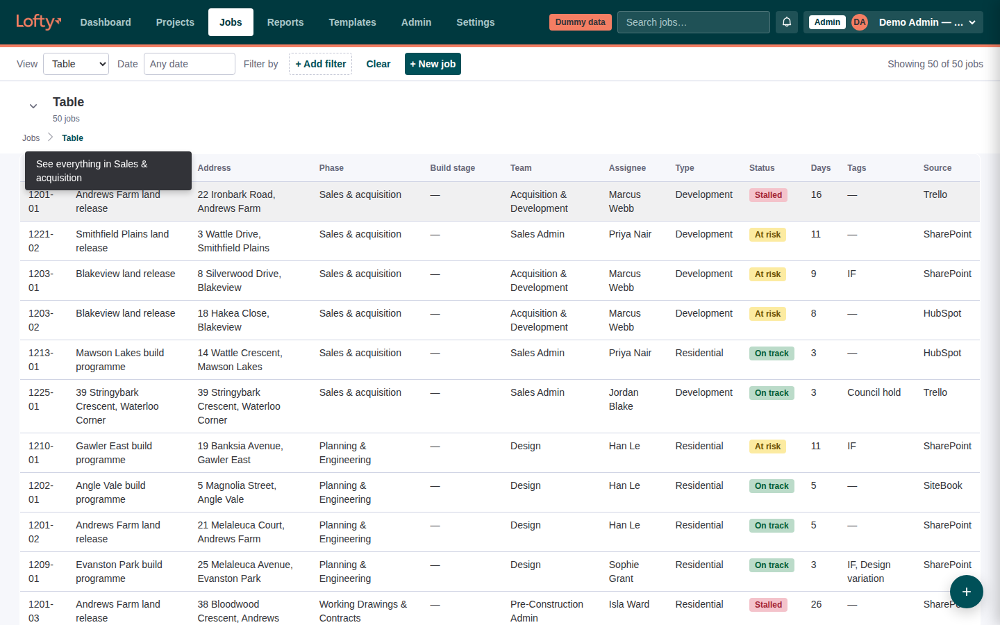

**Prototype.** 12 columns: Job no · Project · Address · Phase · Build stage · Team ·
Assignee · Type · Status · Days · Tags · Source; fixed sort stage-then-days
(`renderTable`, `index.html:7221-7257`). No user sorting anywhere in the prototype.

**App today.** 9 columns (Job / Project / Address(token) / Type(token) / Stage / Team /
Assigned-to(token) / Days / Status), rows clickable — **and no sorting**, even though the
app already built a better sorting component than the prototype ever had:
`SortableTable.tsx` (aria-sort, blanks-last, ladder-aware) is used only on Admin.

**To implement.** Apply `useTableSort`/`SortHeader` to the jobs table now (A — this is the
one place the app can leapfrog the prototype cheaply; `react-migration.md:361-363` even
planned sortable-first). Extra columns land with their data: Tags and the dependency
roll-up are C (G6); Source exists on the import staging design and can join the table at
Phase B; Build stage returns as a nested-pipeline position, not a column.

```
Prototype: loftyprojectboard/index.html:7221-7257 (renderTable)
App today: app/src/pages/JobsPage.tsx:219-252 (Table view);
           app/src/components/SortableTable.tsx (useTableSort — reuse this)
```

---

#### G13 · Real Gantt — **B + C**

**Update (rev 3, 26 Aug): built against real facts.** A day-grid Gantt
(`JobsGantt.tsx`): sticky left column, weekend shading, phase-tinted band rows, an
orange today line — and each bar is the job's stay in its CURRENT stage: solid elapsed
(real), tinted on to entered + expected days where the stage has an SLA, rust when past
it. The prototype's fabricated duration model was not ported, exactly as this entry
said; dependency connectors still wait on G6's task wiring.

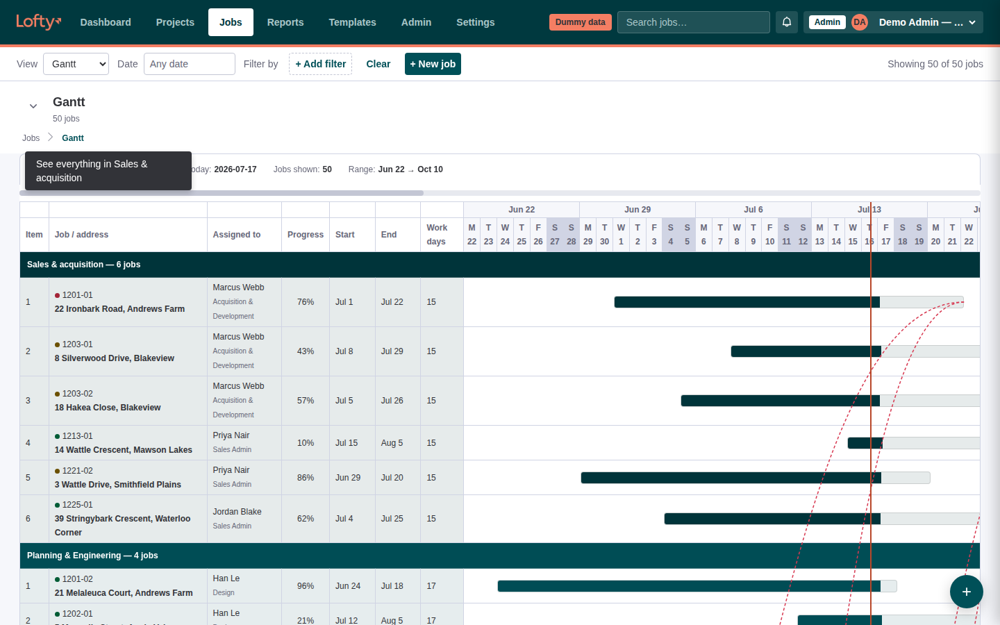

**Prototype.** A full day-grid Gantt (`renderGantt`, `index.html:9709-9835`): sticky
week/day header with weekend shading, seven sticky left columns (job/address, assignee,
progress %, start, end, work days), a **full-width phase band row** per stage in the phase
strip colour, per-job bars (tint = planned window, strip-colour fill = elapsed progress),
an orange "Today" line, health dots per row, and **SVG bezier dependency connectors**
between bars — red-dashed while blocked, grey when clear (`drawDependencyLines`,
`:9837-9888`). An info strip above states portfolio, today, jobs shown, range.

**App today.** "Gantt" renders one labelled 8px progress track per job — fill only where
the stage has an expected duration, which today is nowhere, so it shows the honest message
"No stage has an expected duration set…" (`JobsPage.tsx:254-289`).

**To implement.** Named the **largest single unknown** in `react-migration.md:402-414`
(hand-port vs a library). Two data gaps before it can be honest (C): a per-job **planned
window** — the prototype fabricated `start` from earliest activity and duration from
`BUILD_STAGE_DAYS`/`PHASE_DAYS` constants (`:9677-9689`), none of which exists or should be
invented; real dates arrive via dated properties (`HANDOFF.md:1116-1179`) or explicit
start/target columns — and stage SLAs being set (G43). Dependency connectors additionally
need G6's dependency wiring. The *rendering* spec above (bands, bars, today line, sticky
columns, connectors) is complete enough to build from once dates exist. Class B besides:
a Gantt over zero rows proves nothing.

```
Prototype: loftyprojectboard/index.html:9709-9835 (renderGantt), 9837-9888
           (drawDependencyLines), 9677-9706 (duration model — do not port), 2998-3135 (CSS)
App today: app/src/pages/JobsPage.tsx:254-289 (bar list)
```

---

#### G14 · Real calendar — **C**

**Update (rev 3, 26 Aug): built, placing only dates that exist.** The month grid
(`MonthCalendar.tsx`): Monday-start, weekend/outside shading, ringed today cell, ‹/Today/›
navigation, 3-per-day with "+N more", click-to-drawer — and the jump-to-nearest-month
empty state survived the port. Entries are the two real dates a job has: the day it
entered its stage, and the SLA due day where one is set. Dated step-properties join
these when they land.

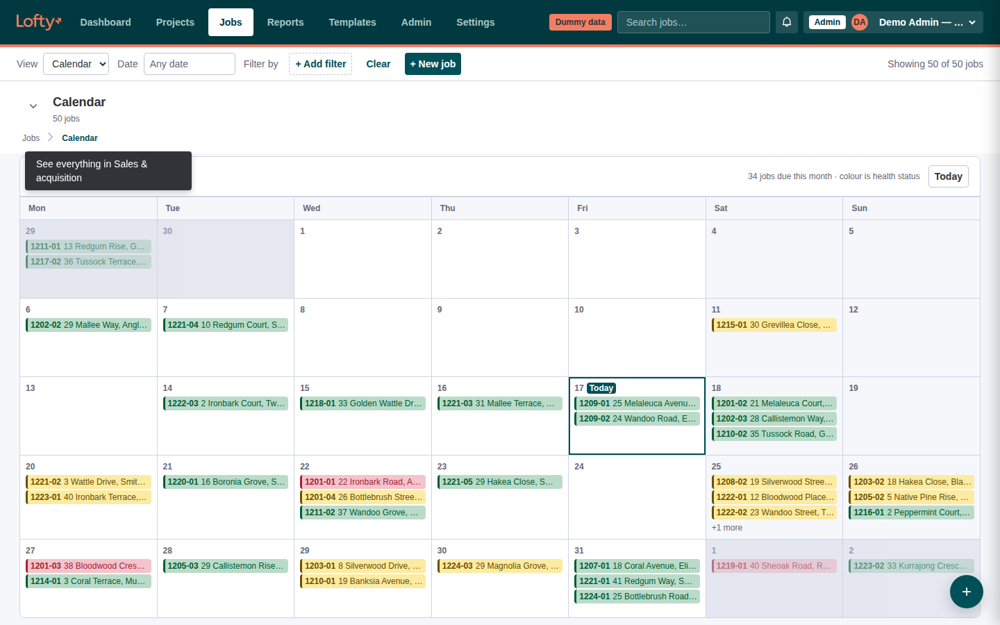

**Prototype.** A month grid (`renderCalendar` + shell, `index.html:9517-9634`, CSS
`:4026-4165`): Monday-start weeks, weekend/outside-month shading, a ringed today cell with
a "Today" chip, prev/next month + a Today button, up to three health-coloured job entries
per day with "+N more" overflow, tooltips, click-to-drawer — and the best empty state in
the prototype: an empty month offers **"Jump to {nearest month with entries}"**
(`calendarEmptyState`, `:9548-9558`). Below 900px it drops to a 2-column layout. Entries
are placed on a **due date** the prototype derives (activity start + estimated duration,
`jobDueDate`, `:9604-9607`) — the derivation is fabricated; the grid is not.

**App today.** "Calendar" is a token table (Job / Stage / `{{property_defs.label}}` /
`{{property_values.value}}`) — a deliberate placeholder (`JobsPage.tsx:291-317`).

**To implement.** The month grid ports cleanly (~120 lines, `react-migration.md:330-332`
says exactly this — no Vibe component exists, it's yours to maintain). Blocked (C) on a
real dated thing to place: dated step-properties (`HANDOFF.md:1116-1179`) are the likely
source — "what lands in this month" = due/step dates in that month. Keep the
jump-to-nearest-month empty state; it's the difference between a calendar that helps and
one that shrugs.

```
Prototype: loftyprojectboard/index.html:9517-9634 (grid, nav, empty state), 4026-4165 (CSS)
App today: app/src/pages/JobsPage.tsx:291-317 (token table)
```

### The job drawer

---

#### G15 · Drawer: fullscreen toggle and tabs — **A**

**Update (rev 3, 26 Aug): built.** Fullscreen shows the four-tab bar (Main info · All
properties · Activity &amp; comments · Departments), sticky while the drawer stays open;
docked remains one scrolled column. All-properties and Activity carry real
`PropertySlots`/`CommentsPanel` plus declared coming-soon notes; Departments renders the
handoff shape as a labelled placeholder (G21 still parked for real history).

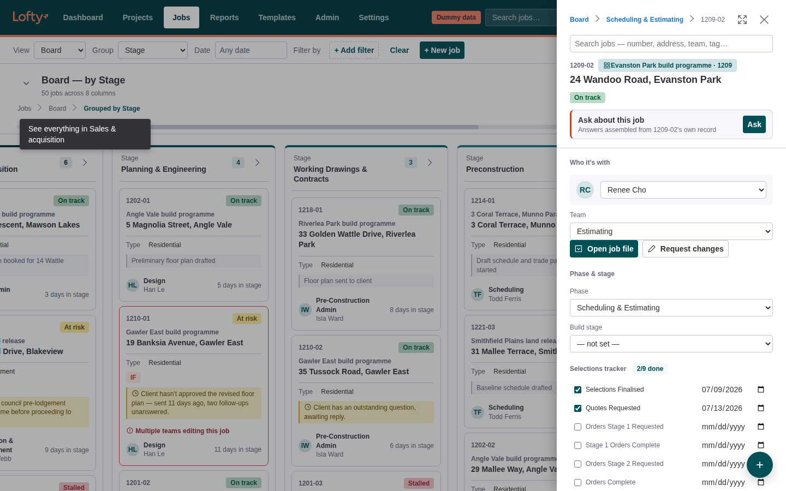
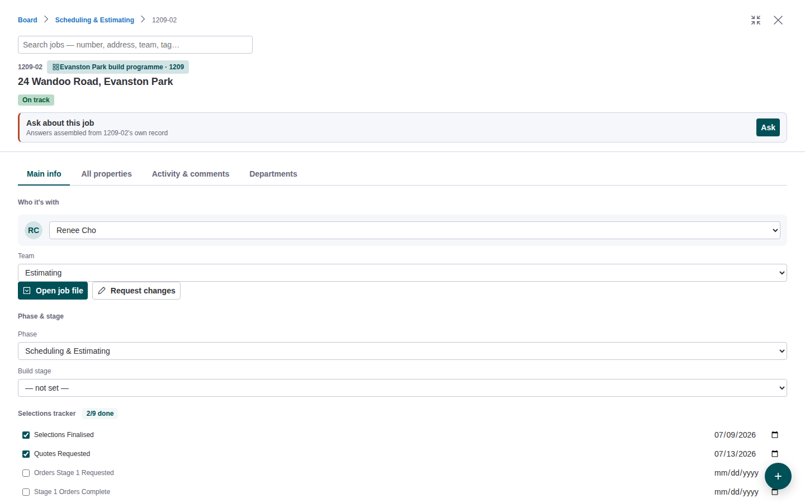

**Prototype.** The drawer has two modes. **Docked** (420px right panel): a single scrolled
column — main info, then the activity feed, then "All properties" behind a `<details>`
disclosure. **Fullscreen** (100vw, toggled by an icon button, sticky across job changes
until collapsed): a two-column layout with a real tab bar — Main info · All properties ·
Activity & comments · Departments (`index.html:10334-10364`; CSS `:2328-2360`,
`:2545-2556`). The active tab is sticky across re-renders so editing a field doesn't
bounce you to Main info (`:10372`). Departments is fullscreen-only ("in a 420px column it
read as a wall of repeated fields", `prototype-handover.md:281-294`).

**App today.** One mode: a 460px read-only panel, sections stacked, no tabs, no fullscreen
(`JobDrawer.tsx`).

**To implement.** The container work is pure A: a fullscreen state (the `CreatePanel`
already does exactly this expand/shrink dance at 460↔1100px — `CreatePanel.tsx`,
`ui.css:626-711` — reuse the pattern), Vibe `Tabs` in fullscreen, `<details>`-style
disclosure when docked, tab choice in the URL (`/jobs/1042-01?tab=activity`) per the app's
routing discipline. What fills the tabs is G16–G22.

```
Prototype: loftyprojectboard/index.html:10334-10364 (tabbed vs stacked), 2328-2360 +
           2545-2556 (drawer CSS), 10372-10391 (sticky tab, toggle)
App today: app/src/components/JobDrawer.tsx (single-mode, read-only);
           expand pattern to reuse: app/src/components/CreatePanel.tsx, ui.css:626-711
```

---

#### G16 · Drawer: editable controls and the single write path — **C**

**Prototype.** On Main info: assignee select, team select, phase select, build-stage select
— each writing through **one** coercing write path, `updateJobProperty`
(`index.html:10633-10670`): days parsed and validated, tags split/trimmed, `dependsOn`
entries **kept only if the job number actually exists** (a typo can't create a phantom
dependency), a phase change resets days-in-stage, and every genuine change appends an
activity row "`owner` changed from 'Design' to 'Estimating'". Two fields are deliberately
**not** editable on the panel: health (derived) and type (project-level) — "the first place
the read/write split shows up in the UI rather than just the role matrix"
(`prototype-handover.md:302-305`).

**App today.** The drawer is 100% read-only. No update method for jobs exists on the
repository at all (`repository.ts` has creates and deletes, no `updateJob`).

**To implement (C).** In order: (1) an `updateJob(jobNumber, patch)` repository method —
the seam rule means no component touches Supabase directly; (2) **RLS policies to match**
— every editable control needs a policy or the control is decoration (CLAUDE.md); scopes
per the answered decision: managers may move jobs between stages and lifecycle phases
(`HANDOFF.md:1206-1227`); (3) activity logging server-side (trigger), not client-side —
the app already has `activity_audit` for profiles; extend the pattern; (4) then the
selects, following the app's existing inline-edit idiom (`UserRow.tsx:118-237` sends only
changed fields). The prototype's validation rules above are the spec for the patch
coercion. Team select uses the null-not-slug rule (`useTeamLabels`,
`HANDOFF.md:44-80`).

```
Prototype: loftyprojectboard/index.html:10170-10226 (Main info controls), 10633-10670
           (updateJobProperty — the coercion spec)
App today: read-only: app/src/components/JobDrawer.tsx; no updateJob in
           app/src/data/repository.ts; inline-edit idiom to copy: app/src/components/UserRow.tsx:118-237
```

**Update (rev 2).** The pattern this entry asked for now exists twice: `moveJobStage`
(method + DB-side guard triggers + a confirming dialog, PR #37) and the patch-shaped
`updateProject` (`supabaseRepository.ts:1028-1048`, `"key" in patch` so undefined ≠ null)
— new job-field editing should copy those, not invent a third shape. The drawer's editable
surface today: the stage move and the comment box. Assignee/team editing is now
**decided** (Q2: assignee team + user columns on jobs and projects, auto-assigned to
Acquisition & Development on creation) — schema first, then an `updateJob` following the
`updateProject` precedent, then the selects.

---

#### G17 · All-properties view — **C**

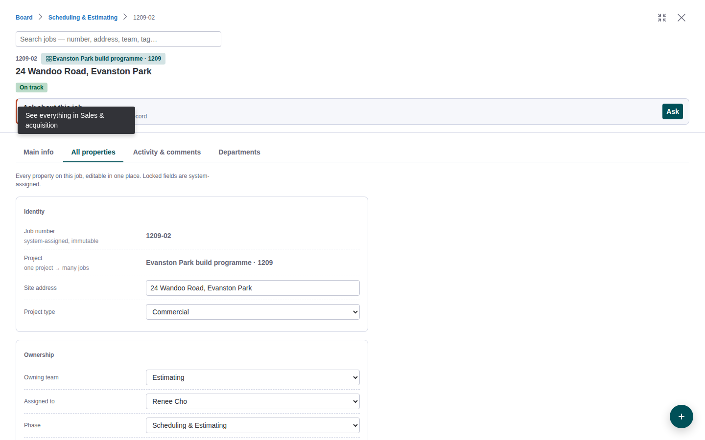

**Prototype.** Every field on the job in one grouped view — Identity / Ownership /
Commercial / Status & flags / Notes — with locked rows for system fields (job number
"system-assigned, immutable", project, source "set on import"), hints per field, and
role-dependent intro text (`allPropsHtml`, `index.html:10256-10316`).

**App today.** The drawer's `PropertySlots` component exists and renders
definition-driven fields grouped by scope with a project/job split
(`PropertySlots.tsx`) — but `listPropertyDefs` returns `[]` because `property_defs`
doesn't exist (`supabaseRepository.ts:899`), so the panels render nothing.

**To implement.** The column-backed identity/ownership fields can appear now (A-ish — they
extend G16's tab); the definition-driven bulk is **C on `property_defs`**, which is Phase C
work with its own open questions (~126 preconstruction definitions, required-to-exit,
select options — `HANDOFF.md:1079-1179`, `:1228-1232`). The grouping labels and
locked-row treatment port as-is. Permission split per the ladder: admin cannot create or
change properties, superadmin can (`schema-plan.md:151-159`).

```
Prototype: loftyprojectboard/index.html:10256-10316 (allPropsHtml), 10234-10254
           (textField/selectField helpers), 605-632 (.prop-row layout)
App today: app/src/components/PropertySlots.tsx (renders nothing until property_defs
           exists); app/src/data/supabaseRepository.ts:877-901 (the empty returns)
```

**Update (rev 2).** `property_defs` now exists (`0043`) with a working Setup screen
(G42), but it ships empty — nothing seeded, by design — so the slot panels still render
nothing until a superadmin defines fields. And even then the *value* half is still a
token: `property_values` has no table and no repository method
(`PropertySlots.tsx:73`). This gap's blocker narrows from "the definitions table" to
"**`property_values`**".

---

#### G18 · Unified activity & comments feed with @mentions — **C**

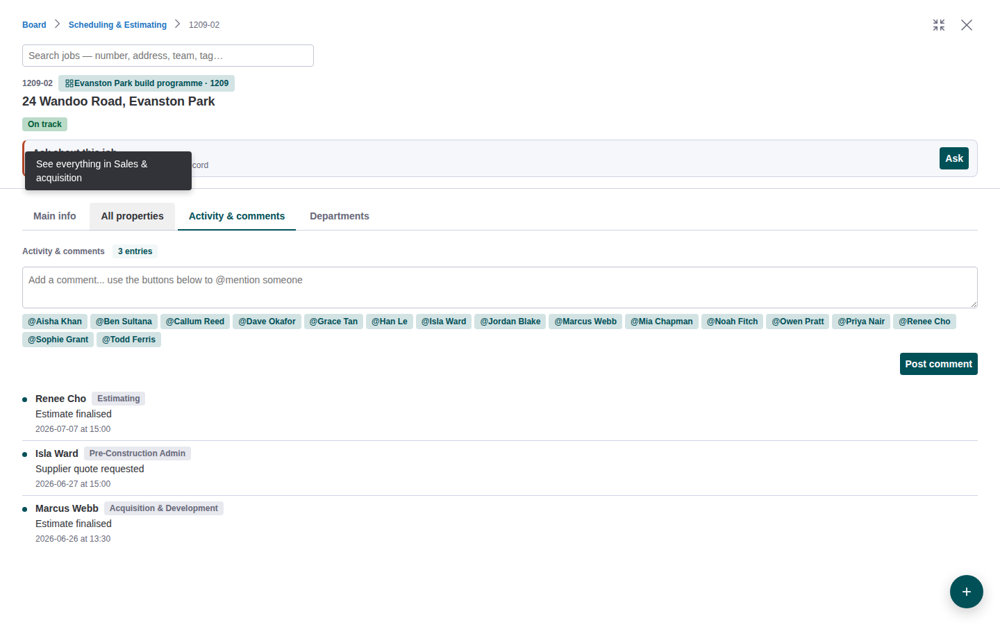

**Prototype.** Activity entries and comments merged into **one feed**, newest first, ties
broken by insertion order — "one event, one row"; posting a comment does not also write a
'Comment added' activity row (`index.html:10018-10031`, `prototype-handover.md:296-300`).
Feed rows: a dot (primary for activity, orange for comments), author + a tag chip (the
department for activity, "Comment" for comments, plus a provenance tag like "from project
1203" on pushed comments), the text with `@Name` rendered as mention chips (longest-name-
first matching so multi-word names win, `formatCommentText`, `:9953-9963`), date+time. A
comment form with a textarea and one @mention button per team member that splices the
mention **at the caret** (`insertMention`, `:10483-10493`); posting toasts.

**App today.** Two token lines: `{{activity.description}}` and `{{comments.author_name}} —
{{comments.body}}` (`JobDrawer.tsx`, Activity & comments section). `Comment` and
`ActivityEvent` types exist (`types.ts`) and comment tables were built in `0024`–`0033`,
but no repository method reads or writes job comments/activity.

**To implement (C).** Repository methods `listJobFeed(jobNumber)` (a merged query or view —
the merge rule above is the spec) and `addComment`; RLS for both; mention detection worth
storing structurally (a `comment_mentions` join) rather than re-parsing text, since
notifications (G1) fan out from it. The mention **buttons** should become a proper
combobox at 47 profiles (the prototype's row of 16 buttons doesn't scale); Vibe `Combobox`
is available-unused. Keep: one feed, comment-tint styling, provenance tags, no duplicate
activity row.

```
Prototype: loftyprojectboard/index.html:10018-10031 (merge), 10318-10328 (panel), 10483-10509
           (mentions, postComment), 9953-9963 (formatCommentText)
App today: app/src/components/JobDrawer.tsx (two token lines); types exist in
           app/src/data/types.ts; no feed methods in app/src/data/repository.ts
```

**Update (rev 2): comments are built.** `CommentsPanel` (new in PR #37) reads and writes
real comments on both jobs and projects — `listComments`/`addComment`
(`supabaseRepository.ts:680-712`), author stamped by trigger, newest first, Enter submits,
`can("user")`-gated; it sits in the drawer as "Updates & comments" (`JobDrawer.tsx:197`)
and on the project page as "Latest update" (`ProjectsPage.tsx:549`). Still missing, and
the panel says so itself (`CommentsPanel.tsx:20-23`): the **unified** feed —
`activity_events` has no writer, so stage moves land only in the forensic
`activity_audit`; **mentions** — `comment_mentions` exists in the DB (`0032`) with no UI
or method (and Q2's assignee decision now gives mentions someone to fan out to); and
comment edit/delete UI. The merge rule and mention-chip spec above remain the target.

---

#### G19 · In-drawer search and jump — **A**

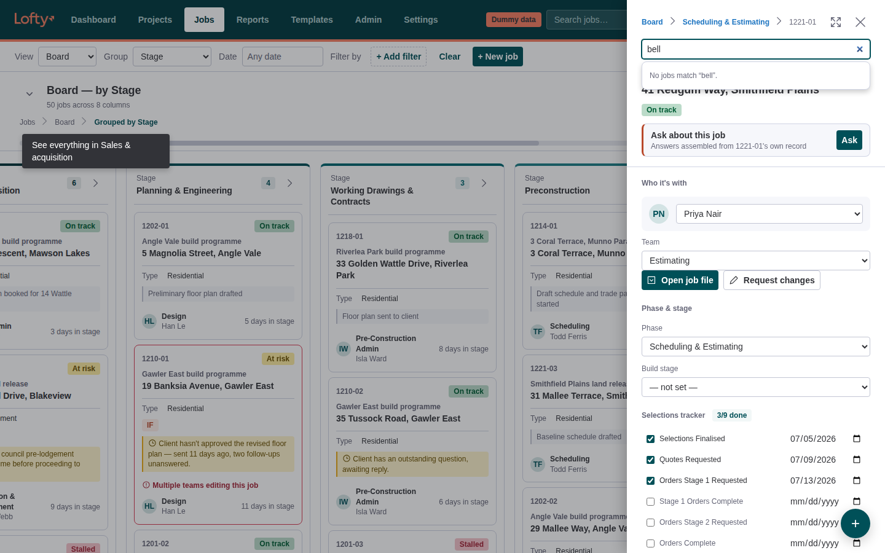

**Prototype.** A search box in the drawer head ("Search jobs — number, address, team,
tag…") drops results into an anchored panel — up to 12 rows of job no + address + stage ·
assignee · status, with **matched substrings highlighted** — and clicking one swaps the
drawer to that job **without closing it** (`jumpToJob`, `index.html:10441-10446`; results
`:9971-10006` region). The point: triaging ten jobs in a row without ten
open-close-scroll-find cycles.

**App today.** No search in the drawer; the header search filters the page behind it.

**To implement.** Pure A: the matcher already exists and is shared
(`jobMatchesQuery`, `SearchProvider.tsx`), the drawer already navigates by URL — a result
click is `navigate(`/jobs/${no}${search}`, { replace: false })`. Highlighting: Vibe
`TextWithHighlight` (already used in the app's design vocabulary). Keep results keyboard-
navigable.

```
Prototype: loftyprojectboard/index.html:10423-10446 (onDrawerSearch, jumpToJob),
           10806-10812 (highlightMatch)
App today: absent; matcher at app/src/data/SearchProvider.tsx (jobMatchesQuery),
           drawer head at app/src/components/JobDrawer.tsx:60-70
```

---

#### G20 · Drawer polish: project chip, Esc two-step, focus, scroll preservation — **A**

**Update (rev 3, 26 Aug): Esc is a two-step** — in fullscreen the first press shrinks
back to the docked panel, the second closes. The project chip's job is done by the
breadcrumb + project link already; scroll preservation joins with the drawer search
(G19).

**Prototype.** Four behaviours worth keeping:
- The **project chip** in the head ("Evanston Park build programme · 1209") — "the job
  never appears without its parent, because 'which project is this?' is the first thing
  anyone asks"; clicking it **closes the drawer first** so you don't land on the project
  with the job covering it (`openProjectFromJob`, `index.html:8391-8396`).
- **Esc is a two-step**: first press exits fullscreen, second closes (`:10459-10465`).
- The drawer breadcrumb's middle crumb **walks back to a real place** — it closes the
  drawer, forces board+phase view, and opens that phase's drill-down (`drawerCrumbPhase`,
  `:10412-10421`).
- **Scroll-preserving refresh**: every in-panel edit re-renders via
  `refreshDrawerInPlace`, which captures and restores `scrollTop` (`:10571-10577`) —
  without it a 53-row checklist is unusable.

**App today.** Breadcrumbs + a subline project `Link` exist (`JobDrawer.tsx:60-70`); Esc
closes in one step (no fullscreen yet); and there's a **documented focus bug** — focus
moves into the drawer only on first mount, not when navigating drawer-to-drawer
(`JobDrawer.tsx:22-24`). Scroll preservation is moot until the drawer re-renders on edits
(G16), then required.

**To implement.** With G15/G16: chip styling + close-first navigation; two-step Esc;
re-focus on job change (fix the noted bug); keep React's reconciliation from scroll-
jumping the panel on save (stable keys usually suffice; verify against the checklist tab).

```
Prototype: loftyprojectboard/index.html:8391-8396, 10412-10421, 10459-10465, 10571-10577
App today: app/src/components/JobDrawer.tsx:22-24 (focus bug note), :60-70 (breadcrumbs)
```

---

#### G21 · Departments / handoff view — **D**

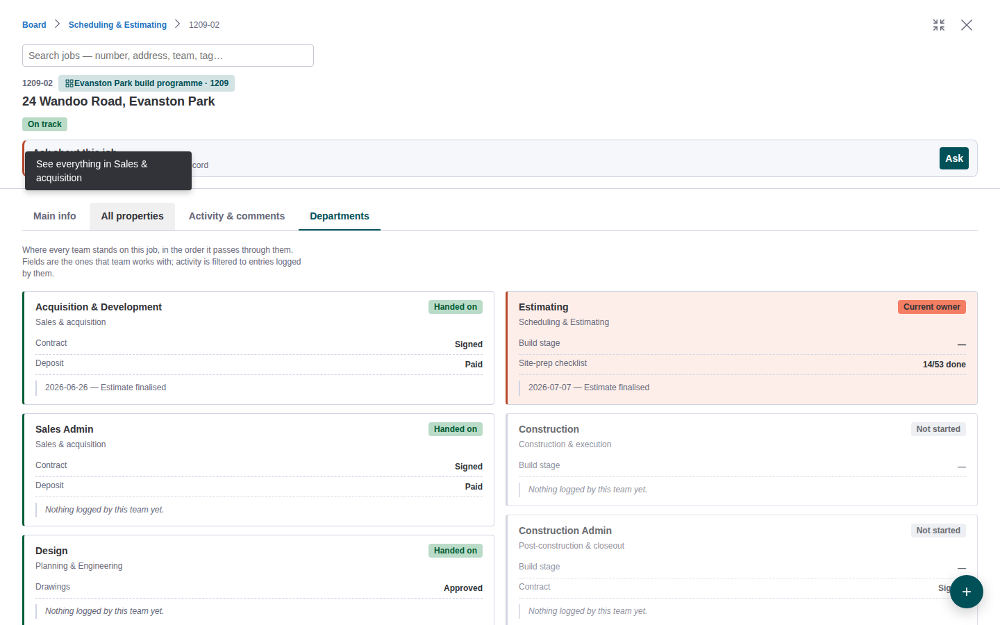

**Prototype.** "Where every team stands on this job, in the order it passes through them":
one block per team per phase, stated as **Current owner / Handed on / Not started**
(orange / green / dimmed left rules), each with the fields that team works with and the
activity entries attributed to it (`departmentsHtml`, `index.html:10131-10168`;
`getJobDepartments`, `:6042-6057`). Fullscreen-only.

**App today.** Absent. The drawer's "Who it's with" shows the current team only.

**To implement (D).** The prototype's version depended on two things the current model
rejects or hasn't decided: a phase→department ownership map (answered: lifecycle phases
have **no** owning team, `schema-plan.md:507-512` — ownership exists only on nested-
pipeline stages) and per-team field lists (property definitions + team grants, Phase C).
The *concept* — a handoff timeline per job, who had it, who has it, who's next — is
exactly concept-spec's "one team at a time, visible to everyone" (`concept-spec.md:38-44`)
and should be rebuilt from real handoff history (team changes in the activity log) once
G16/G18 write it, rather than from a static map. Park until then; don't fake the states.

```
Prototype: loftyprojectboard/index.html:10131-10168 (departmentsHtml), 6026-6065
           (DEPARTMENT_FIELDS, states, per-team activity), 2478-2543 (CSS)
App today: absent
```

---

#### G22 · Scheduling checklists — **D**

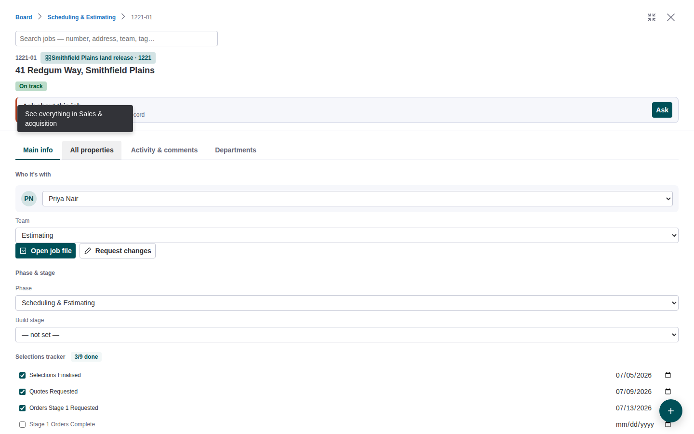

**Prototype.** For jobs in its scheduling phase: a **Selections tracker** (9 steps, each a
tick + a date input, coupled both ways — ticking dates it today, dating it ticks it,
un-ticking clears the date; `index.html:10579-10602`) and a **53-field site-prep
checklist** (tick + free-text value per row; supplier fields get names, others get
complete/pending markers; a user-typed value is never overwritten by a tick,
`:10604-10629`). Ticking a selections step moves the job's card between columns on the
scheduling drill-down in real time. The handover doc calls this "where the prototype comes
closest to the real thing" (`prototype-handover.md:219-232`).

**App today.** The drawer's Milestones panel ("checkpoints" until 26 Aug — Lofty's
word is milestones) renders disabled checkboxes from `listTemplateMilestones` — which returns `[]` because `pipeline_stage_tasks` doesn't
exist; the panel is an empty box (and needs an empty-state message even before this gap is
filled — one-line fix in `JobDrawer.tsx`).

**To implement (D).** Blocked on the real process decision: the 57 preconstruction steps
have no home; the current design direction is **dated properties with a thin position on
top** (~126 property definitions) rather than milestone rows (`HANDOFF.md:1079-1179`),
with two open sub-questions (auto-move position when a date is filled; does each step want
a person as well as a date). When it lands, the prototype's interaction spec is the
valuable part: tick↔date coupling, don't-overwrite-typed-values, board-position coupling,
scroll preservation. **Nothing gets seeded from the prototype's step lists** — they're
invented.

```
Prototype: loftyprojectboard/index.html:10086-10127 (render), 10579-10629 (toggle/date/value
           rules), 5958-5990 (step lists — do not seed from these)
App today: app/src/components/JobDrawer.tsx (empty milestones panel);
           app/src/data/supabaseRepository.ts:886 (listTemplateMilestones → [])
```

---

#### G23 · "Ask" callout and AI dock — **D**

**Update (rev 3, 26 Aug): the shell exists, saying coming soon.** The FAB and 380px dock
(`AskDock.tsx`) with the scope line and example questions shown as previews, plus the
"Ask about this job" callout in the drawer head opening it pre-scoped. Nothing answers —
the dock says so — and the fact-assembly wiring stays the D→build step.

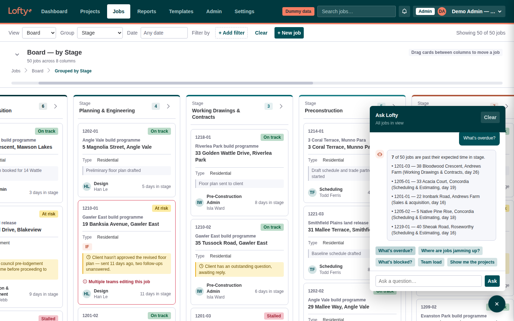

**Prototype.** One AI surface: a floating dock (FAB bottom-right rotating into an ×; a
380px window with a scope line — the open job, else "All jobs in view"), suggestion chips,
and an "Ask about this job" callout in the drawer head that opens the dock **pre-seeded
with the job summary** because "opening from a job is itself the question"
(`askAboutJob`, `index.html:7547-7560`). Answers are keyword-routed over the real record —
no model; the stated value is proving **the context is there to assemble**
(`:7459-7460`). Portfolio answers respect the active filters. An earlier in-drawer chat
pane was deliberately removed — one assistant, not two (`prototype-handover.md:319-326`).

**App today.** Absent entirely.

**To implement (D).** Explicitly an open decision: "does the AI assistant survive"
(`react-migration.md:402-414`), and concept-spec says **no active AI features this phase**
(MCP foundation first, `concept-spec.md:46-51`). If it returns: keep the one-surface rule,
the scope model (open job > typed number > filtered portfolio, `:8720-8736`), and the
context-assembly approach — the keyword matcher's *fact assembly*
(`jobSummaryFacts`, `:7469-7487`) is a ready-made spec for what a real LLM call should be
handed. Decide before building anything.

```
Prototype: loftyprojectboard/index.html:8761-8797 (dock), 7459-7560 (answers, askAboutJob),
           8672-8736 (portfolio answers, context resolution)
App today: absent
```

**Update (rev 2): decided — it survives** (Amber, Q3). The open question closes as yes.
Sequencing stands: build once comments (now real), SLAs (G43) and assignment (Q2) give the
dock real context to assemble; the fact-assembly spec above is what a real model call gets
handed.

---

#### G24 · "Open job file" (SharePoint link) — **C**

**Update (rev 3, 26 Aug): built.** The drawer's Main info gained a Folders panel with
both links — the job's own subfolder and its project's folder, per Lofty's rule — and an
honest "no folder linked yet" when unset. `BoardJob` carries both URLs now.

**Prototype.** A primary button on Main info opening the job's SharePoint file — mocked as
a fake page clearly labelled as such (`openDummySharePoint`, `index.html:9905-9939`; the
Microsoft-style styling was kept deliberately, it imitates an external system,
`design-system-evaluation.md:265-280`).

**App today.** Absent. `documents` / `DocumentLink` tables and types exist (`0024`–`0033`,
`types.ts`) but nothing reads them.

**To implement (C).** Once document links carry real SharePoint URLs (import or manual), a
plain external link button in the drawer head region — no mock page, obviously.

```
Prototype: loftyprojectboard/index.html:9905-9939 (openDummySharePoint — the button, not the mock)
App today: absent; document types in app/src/data/types.ts
```

**Update (rev 2): now class A — the data landed, only the UI is missing.** `0040` added
`projects.project_sharepoint_url` and `jobs.job_sharepoint_url` (https-checked); the
project page already has the editable URL field and an "Open folder" link
(`ProjectsPage.tsx:459-485`); the job's own and its project's URLs are selected and typed
(`Job.sharepointUrl` / `Job.projectSharepointUrl`, `types.ts:340-347`) — but **nothing
renders them on the job**: the drawer has no folder row and `BoardJob` doesn't carry the
fields (`boardModel.ts:32-69`). Remaining work: two link rows in the drawer (own folder +
project folder, per Lofty's rule that a job shows both), and carrying the fields through
`boardModel`.

---

#### G25 · "Request changes" flow — **D**

**Update (rev 3, 26 Aug): the entry point ships** — "Request changes" in the drawer
head, answering that the flow rides the variations model (Q8: waiting-on is part of the
variation request).

**Prototype.** A secondary button that flips to a green "Changes requested" state and
badges the assignee with a count; the "waiting on" text shows on the card, on Main info
(with a requester the prototype *guesses* from the wording — superseded, see §1.3), and
feeds the change-request notification (`requestAccess` + `.requested-flag`,
`index.html:10511-10520` region, card at `:6938-6942`).

**App today.** Absent; no waiting-on model in the schema. The prototype-handover gap list
itself flags `requested`-as-free-text as unmodelled (`prototype-handover.md:709-726`).

**To implement (D).** Needs a decision on what a change request / waiting-on *is* — a
property, a task, or its own table with requester, requestee, and resolution. Related to
concept-spec's conflict-flagging P0. The UI (button state, amber blocks, notification) is
trivial once modelled; model first.

```
Prototype: loftyprojectboard/index.html:6938-6942 (card block), 10170-10226 (button in Main info)
App today: absent
```

**Update (rev 2): confirmed wanted** (Amber, Q8): waiting-on / change requests are
modelled **as part of the variation request** — details TBC but "very important to keep".
The `variations` tables already exist in the schema; when the variation flow is designed
(with G31), the amber card block, the panel row, and the notification type above are the
UI spec waiting for it.

### Projects

---

#### G26 · Project cards: progress, per-job lines — **B + C**

**Update (rev 3, 26 Aug): progress is real.** The card's bar is jobs-completed over
jobs-total — the one per-job fact the card already holds ("1 of 3 jobs completed") —
with the prototype's task-based progress joining when tasks are wired. Per-job lot
lines landed earlier (PR #39).

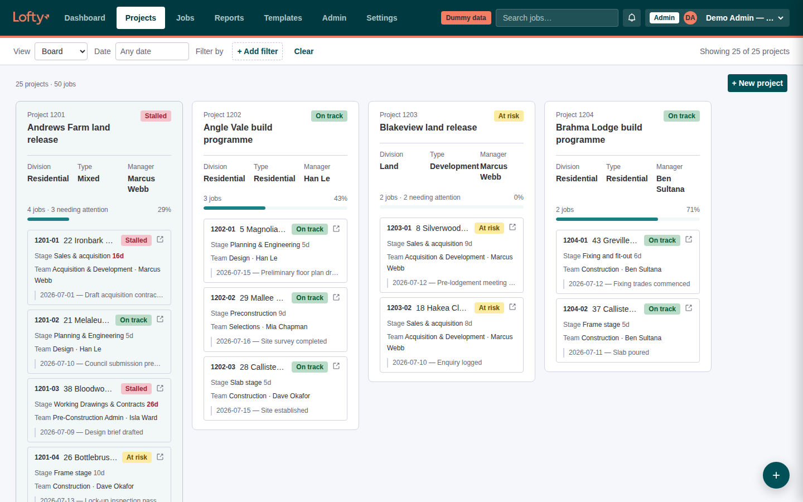

**Prototype.** A project card carries: name + worst-of-jobs health pill · a meta row ·
a progress bar (average stage-index of its jobs, `projectProgress`,
`index.html:5936-5941`) with "{N} jobs · {M} needing attention" · then **one line per job**
(`.pjl`, `:8127-8146`): number, address, status pill, open icon, "Stage X · Nd" with the
day count flagged red when over expected, team · assignee, and the job's last activity
line. Job lines are independently clickable.

**App today.** `ProjectCard` shows "Project {n}" + status pill, address/suburb/type/target
as **tokens**, "{n} jobs on this project", and a list of job numbers + address tokens
(`RecordCards.tsx:93-151`).

**To implement.** First a **wiring fix (C, small)**: `BoardProject` declares
`currentAddress`/`originalAddress` but `useBoardRecords` never populates them
(`boardModel.ts:74-75` vs `:135-141`) — that's why every project address in the app is a
token even though `addresses` is a real table. Fix the join; the tokens on cards, tables
and the detail header resolve at once (visible once Phase B imports rows). Progress and
per-job lines are B: progress needs pipeline positions on real jobs (worst-of status
roll-up is already computable — the app just doesn't show it on cards); per-job activity
lines need G18. Division/manager meta does not return (§1.3); the meta row becomes
suburb · type · target.

```
Prototype: loftyprojectboard/index.html:8262-8297 (cards), 8127-8146 (.pjl), 5929-5941
           (derived status/progress), 883-973 (CSS)
App today: app/src/components/RecordCards.tsx:93-151 (ProjectCard);
           app/src/data/boardModel.ts:74-75 + 135-141 (the unpopulated address fields)
```

**Update (rev 2): the join fix landed.** `useBoardRecords` now populates `currentAddress`,
`originalAddress`, `suburb`, `council`, `stage`, `stageEnteredAt`, `startDate`, `endDate`,
`targetCompletion`, `sharepointUrl` on every `BoardProject` (`boardModel.ts:170-191`, via
the embed in `PROJECT_COLUMNS`) — project addresses resolve on cards, tables and the
detail header the moment Phase B supplies rows. Remaining as written: the progress bar
(projects now *have* a lifecycle stage that follows the slowest job, `0041` — so a
position-based progress read is finally computable), the per-job `.pjl` lines (last
activity needs G18's feed), and the worst-of health roll-up — noting cards currently show
no status pill at all (`RecordCards.tsx:33`).

---

#### G27 · Project table columns — **C**

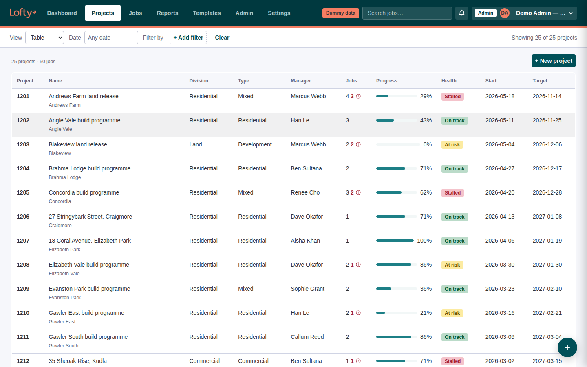

**Prototype.** Project · Name+suburb · Division · Type · Manager · Jobs (with a red "⚠ N"
when any job isn't on track) · Progress (inline bar + %) · Health · Start · Target
(`renderProjectList`, `index.html:8149-8186`).

**App today.** Project · Address(token) · Suburb(token) · Type(token) · Target(token) ·
Jobs · Status (`ProjectsPage.tsx:152-261`), plus the inline new-project row.

**To implement.** Address/suburb/type/target resolve with the G26 wiring fix + Phase B.
Progress column and the at-risk flag follow G26's derivations. Division/Manager columns do
not return. Add sorting via the existing `SortableTable` while touching it (with G12).

```
Prototype: loftyprojectboard/index.html:8149-8186 (renderProjectList)
App today: app/src/pages/ProjectsPage.tsx:152-261 (list mode, Table view)
```

**Update (rev 2).** Address, suburb and target now resolve (G26's join fix). Remaining:
progress + the at-risk flag (with G26), and sorting — the projects table is still plain
`<th>`s, `SortableTable` still Admin-only.

---

#### G28 · Project Gantt and calendar — **C**

**Update (rev 3, 26 Aug): the Gantt half is built.** Projects gained a Gantt view
(`ProjectsGantt.tsx`) drawn from the two real dates a project carries — start date to
target completion, month ticks, today line, rust when past target and not completed —
and projects missing either date are listed underneath with where to set them, not
estimated. The calendar half can reuse `MonthCalendar` when project dates deserve one.

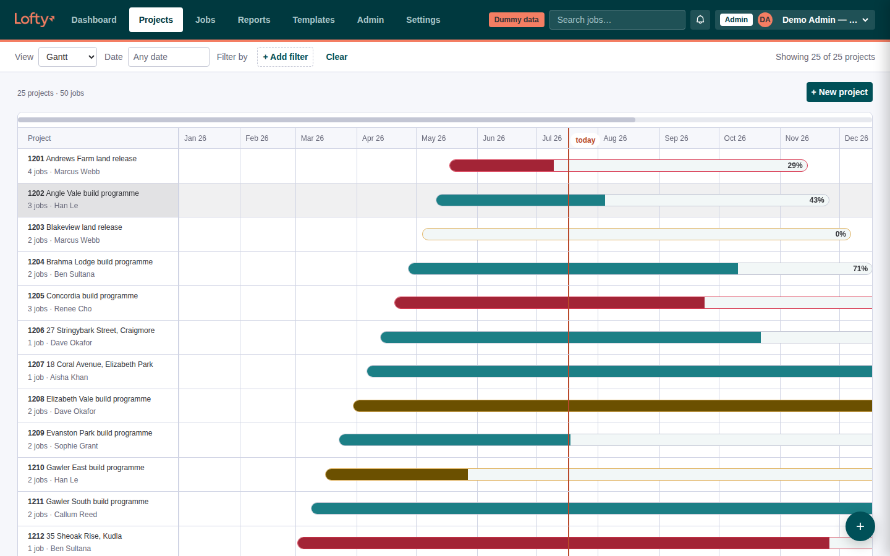

**Prototype.** The project Gantt is a different, simpler model than the job Gantt: month
timeline, one row per project, bar = the explicit start→target window (pill-shaped, health-
coloured border/fill when at risk), inner fill = pipeline progress, today line — and the
documented read: "**a short fill on a bar that is mostly behind the today line is the thing
worth looking at**" (`renderProjectGantt`, `index.html:8193-8260`; rationale
`prototype-handover.md:149-155`). The project calendar plots two milestone kinds — Starts
and Due — per project (`renderProjectCalendar`, `:9636-9661`).

**App today.** Projects page offers Board and Table only (`views={["Board","Table"]}`,
`ProjectsPage.tsx`); start/target render as tokens on the detail page.

**To implement (C).** Needs project start/target dates bound (columns exist on `projects`
per the dictionary; `BoardProject` doesn't carry them — extend the same G26 join) and real
rows. Then this is a genuinely small view (absolute-positioned divs over month gridlines —
no day grid, no dependencies) and arguably lands **before** the job Gantt; it answers
leadership's "where is everything" question with far less machinery.

```
Prototype: loftyprojectboard/index.html:8193-8260 (renderProjectGantt), 9636-9661
           (renderProjectCalendar), 1006-1107 (CSS)
App today: app/src/pages/ProjectsPage.tsx (Toolbar views prop restricted to Board/Table)
```

**Update (rev 2): unblocked.** Start, target and end dates are now real, editable columns
on the project page (`ProjectsPage.tsx:433-454`) and carried on `BoardProject` — the data
gap is gone. Class drops to B: build against real rows after Phase B, and it remains the
cheaper, earlier win than the job gantt.

---

#### G29 · Project detail editing — **C**

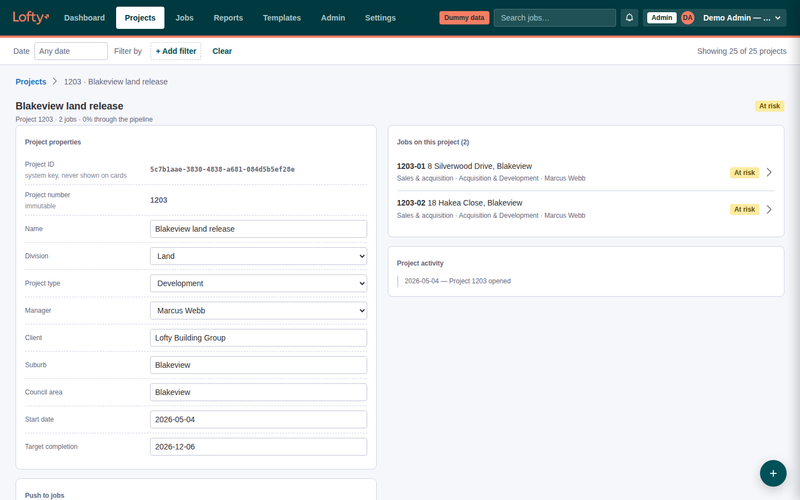

**Prototype.** The detail page's property rows are editable in place for roles with
`editProject` — name, type, manager, client, suburb, council, start, target — each write
appending a project activity entry; system fields (id, number) locked with hints
(`renderProjectDetail`, `index.html:8403-8496`; `updateProjectProperty`, `:8498-8506`).

**App today.** Every project property row is read-only, most are tokens
(`ProjectsPage.tsx:319-336`); no `updateProject` on the repository.

**To implement (C).** Same shape as G16: `updateProject` method + RLS + server-side
activity, then in-place editing per the `UserRow` idiom. Field list per the current
schema (no division/manager/client unless those survive as columns/properties — check the
dictionary, not the prototype). Address edits are **not** a text field — addresses are
their own table with history (`schema-plan.md`); an address change goes through an
address-specific flow. This is spine-adjacent: HANDOFF's spine review explicitly includes
"rename an address, open the job drawer, note anything that makes you say 'that is not how
we work'" (`HANDOFF.md:1008-1020`) — worth sequencing right after that review.

```
Prototype: loftyprojectboard/index.html:8403-8506 (detail + updateProjectProperty)
App today: app/src/pages/ProjectsPage.tsx:264-414 (ProjectDetail, read-only);
           no updateProject in app/src/data/repository.ts
```

**Update (rev 2): largely built.** The project page now reads real values
(address/suburb/council/type resolved) and **writes**: the three dates and the SharePoint
URL through a patch-shaped `updateProject` (`ProjectsPage.tsx:433-483`,
`supabaseRepository.ts:1028-1048`); "+ Add another address" with the history table is live
(`ProjectsPage.tsx:488-545`, trigger in `0042`) — exactly the address-specific flow this
entry asked for, not a text field. It also gained things the prototype never had: a
project lifecycle stage with days-in-phase and a forward-only move control
(`ProjectsPage.tsx:405-422`), following its slowest job by trigger (`0041`). Remaining:
name and type are not editable (check whether they should be), and per Q2 the project
gains editable assignee team + user.

---

#### G30 · Push-to-jobs — **D**

**Update (rev 3, 26 Aug): the entry point ships.** A "Push to jobs…" button sits
beside Create jobs on the project page and answers with what is coming — the flow
itself rides the variations design (Q8), per Amber's placeholder rule.

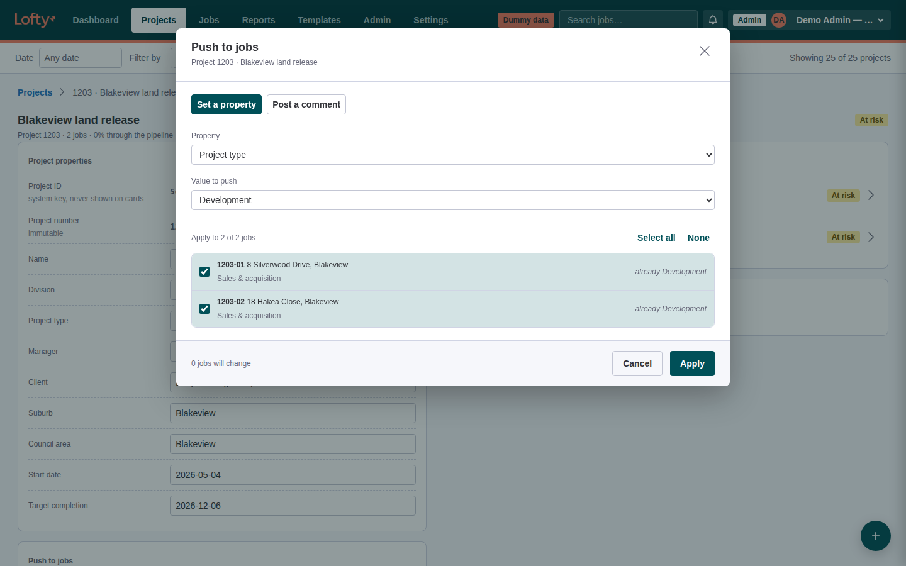

**Prototype.** From a project: push a property value or a comment down to selected jobs,
with the honest preview that made it good (`renderPushModal`/`applyPush`,
`index.html:8547-8666`): per job, current value → new value; already-matching jobs marked
"already Residential" rather than counted; properties with no job equivalent say so
instead of silently doing nothing; select-all/none; a live "**N job(s) will change**"
summary; the apply toasts what happened. Decision recorded: one-off write, **not** sticky
inherit (`prototype-handover.md:164-179`). Pushed comments carry provenance ("from
project 1203") on the comment itself.

**App today.** Absent.

**To implement (D).** The prototype's pushable set (type→job.type, manager→assignee) no
longer exists — job type is gone, assignee is unmodelled. What's pushable in the current
schema needs deciding: candidates are `record_status`, a comment (once G18 lands), and
project-scoped property values once `property_defs` exists. The **interaction spec**
(diff preview, already-matching, no-equivalent honesty, one-off semantics) ports whole and
is the reason to keep this pattern; only the property list is open. Build as a
`CreatePanel` flow.

```
Prototype: loftyprojectboard/index.html:8509-8666 (openPushModal, renderPushModal,
           applyPush), 8079-8083 (PROJECT_PUSHABLE — superseded list)
App today: absent; panel shell to use: app/src/components/CreatePanel.tsx
```

**Update (rev 2).** Amber (Q7): push applies to **what is set at project creation** — the
pattern survives, scoped to creation-set properties. Which exact fields that means (type?
dates? the new assignee team/user from Q2?) firms up alongside the variations design; the
diff-preview interaction spec above stands.

---

#### G31 · Job creation from template with preview — **D**

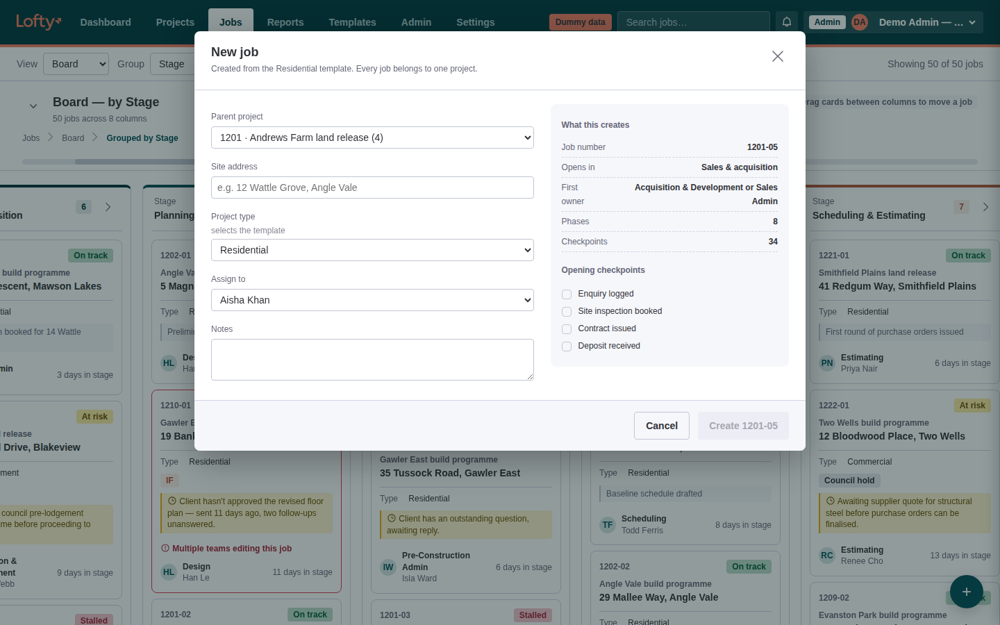

**Prototype.** New job goes through the template: pick parent project (or create one
inline), address, type, assignee — and a live "What this creates" preview: derived job
number, opening phase, first owner, phase count after type-skips, checkpoint count, the
opening checkpoints as empty ticks (`renderNewJobModal`, `index.html:7294-7385`;
`createJobFromTemplate`, `:7387-7451`). On create it opens the new job's drawer.

**App today.** Jobs are created **only from the project screen**, deliberately
(`JobsPage.tsx:143-150`), via the split flow ("Create jobs splits this project into one per
lot"); a fully-implemented `NewJobDialog` sits unused in `CreateDialogs.tsx:405-520` (dead
code from before that decision).

**To implement (D).** Two decisions first: does single-job creation return alongside the
lot-split (the split *is* the current model's answer to "one per lot"; a variation raised
mid-construction is the known case that might need a single add — it's one of Phase B's
hard scenarios, `HANDOFF.md:989-995`), and what a "template" is once milestones are dated
properties (G22). The preview pattern — show the derived number and consequences before
committing — is already half-present in the app's split panel and should extend to
whatever creation flows exist. If single-add returns, resurrect and update `NewJobDialog`
rather than rewriting.

```
Prototype: loftyprojectboard/index.html:7259-7451 (modal, preview, createJobFromTemplate)
App today: split flow in app/src/components/CreateDialogs.tsx; dormant NewJobDialog at
           CreateDialogs.tsx:405-520; placement decision at app/src/pages/JobsPage.tsx:143-150
```

**Update (rev 2).** Amber (Q6): **variations will exist** — how is to be confirmed. The
principle is settled, only the mechanism is open. Note the split flow itself grew per-lot
lot numbers and old job numbers in PR #37 (`createJobsFromSplit` now validates lots before
any insert), so the dormant `NewJobDialog` is further behind the current creation idiom
than at rev 1 — when variations are designed, rebuild against the split flow's validation
patterns rather than resurrecting it as-is.

---

#### G32 · New-project "what this creates" preview — **A**

**Update (rev 3, 26 Aug): built.** The panel states the consequences — next free
1000-series number (the value itself is the sequence's to give, so it is not guessed),
opening team and phase, the -01 job numbering, and the no-jobs-no-health note.

**Prototype.** The new-project modal's right column previews: the project number it will
take, what its first job would be numbered, jobs 0, and the note "A project with no jobs
shows 0% progress and no health until its first job is created"
(`renderNewProjectModal`, `index.html:8313-8365`).

**App today.** `NewProjectDialog` is a working create panel with fields and validation but
no consequence preview.

**To implement.** Add a preview block to the existing panel: next project number (the
sequence rule lives in the schema — surface it, don't re-derive client-side if avoidable),
first job number shape, and the no-jobs note. Small, honest, cheap.

```
Prototype: loftyprojectboard/index.html:8313-8365 (renderNewProjectModal)
App today: app/src/components/CreateDialogs.tsx (NewProjectDialog), shell CreatePanel.tsx
```

### Dashboard

---

#### G33 · Populated personal dashboard — **C + D**

**Update (rev 3, 26 Aug): the real tiles are real, the rest declare themselves.** The
middle column renders your actual assigned jobs (the assignee binding), sorted
most-days-first with days-against-SLA when a stage has one; "N jobs assigned to you" and
the Assigned count are live. Need-you/Overdue show em dashes (nothing computes health
yet), the hero says what it waits for, and the three right-rail panels say what will fill
them. It also stopped counting every job in the company as yours (`jobs.length`).

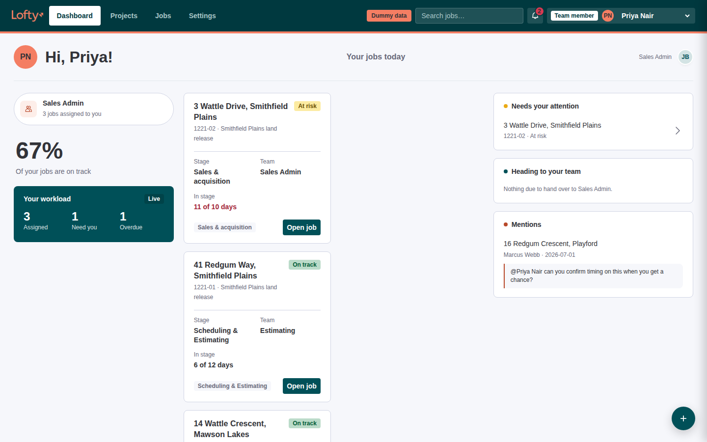

**Prototype.** The landing page, deliberately filter-free ("what should I do today"):
greeting row with teammate avatar stack · "N jobs assigned to you" pill · a hero "67% of
your jobs are on track" · a workload block (Assigned / Need you / Overdue) · a card per
assigned job sorted most-days-first, each with stage/team/in-stage ("11 of 10 days" in
red when over), the waiting-on block, and an Open job button · three live panels: Needs
your attention, Heading to your team, Mentions with quoted comment
(`renderUserDashboard`, `index.html:8926-9070`).

**App today.** The layout exists and matches (greeting, three columns, panels with the
same three headings) but every number is a hardcoded 0, the middle column has no card
rendering path at all, and the right-rail panels show only their empty states
(`DashboardPage.tsx` — the "Live" tag was removed precisely because the figures were
fake). The teammate avatar stack was in the layout once and its data is still hardcoded-
absent (`HANDOFF.md:305-307`).

**To implement.** Everything here is downstream of other gaps, by panel: my-jobs cards and
workload → the assignee model (C); Overdue → SLAs set (G43) + at-risk definition (D);
Mentions → G18 (C); Heading-to-your-team → same redefinition problem as G1's incoming-work
signal (D). The right sequencing: **do not populate any tile until its input is real** —
this page already burned once ("45% on track" from a fixed array, CLAUDE.md). When the
inputs land, the prototype's layout is already the app's layout; the work is the
derivations, done in the data layer with tests, not in the component.

```
Prototype: loftyprojectboard/index.html:8926-9070 (renderUserDashboard, slices at 8926-8947)
App today: app/src/pages/DashboardPage.tsx (static; unused .pd-card CSS at
           DashboardPage.css:117-197 maps to the prototype's card anatomy)
```

**Update (rev 2).** All three blockers now have answers: assignment (Q2 — assignee team +
user columns, auto-assigned to Acquisition & Development on creation), overdue/at-risk
thresholds (Q1 — the SLA spec), and notifications land **on the dashboard and the bell
this phase** (Q4), which makes this page one of the two notification surfaces, not just a
summary. Class drops to C: build each tile as its input lands, still never before.
Cancelled records are excluded from every alert here (lifecycle revision).

### Reports

---

#### G34 · Report KPIs: blocked, conflicts — **C**

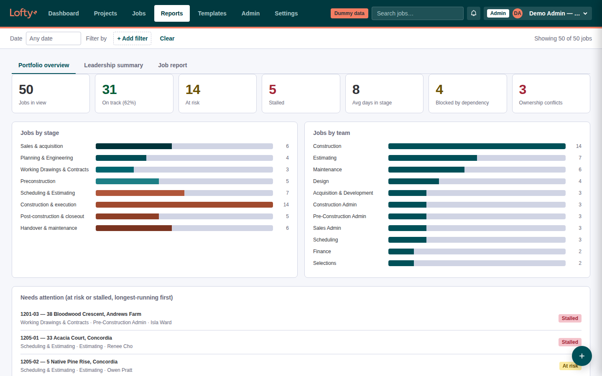

**Prototype.** Seven KPI tiles: the app's five plus **Blocked by dependency** and
**Ownership conflicts** (`renderDashboard`, `index.html:9324-9406`).

**App today.** Five tiles (Jobs in view / On track % / At risk / Stalled / Avg days) —
`ReportsPage.tsx`, Portfolio tab. ("Stalled" here counts a status, which is current-model
correct.)

**To implement.** The two missing tiles follow their models: dependencies (G6 wiring) and
conflict flagging (G25/concept-spec). Add when those exist; don't compute placeholders.

```
Prototype: loftyprojectboard/index.html:9324-9406 (KPI row)
App today: app/src/pages/ReportsPage.tsx (Portfolio overview tab)
```

---

#### G35 · Phase-coloured report bars — **B**

**Update (rev 3, 26 Aug): built** — the "Jobs by stage" bars wear the same ramp as the
board's columns (`STAGE_ACCENTS`), so a report and the board it summarises read as one
system.

**Prototype.** "Jobs by stage" bars are filled in each phase's strip colour, so the report
and the board speak the same colour language (`index.html:9324-9406` with `PHASE_COLORS`,
`:9693-9696`).

**App today.** All bars in one primary colour (`BarPanel`, `ReportsPage.tsx`).

**To implement.** Rides entirely on G5's re-cut ramp; one-line change per bar once the
constant exists.

```
Prototype: loftyprojectboard/index.html:9693-9696 (PHASE_COLORS derivation)
App today: app/src/pages/ReportsPage.tsx (BarPanel)
```

---

#### G36 · Leadership analytics: overruns, bottlenecks — **D**

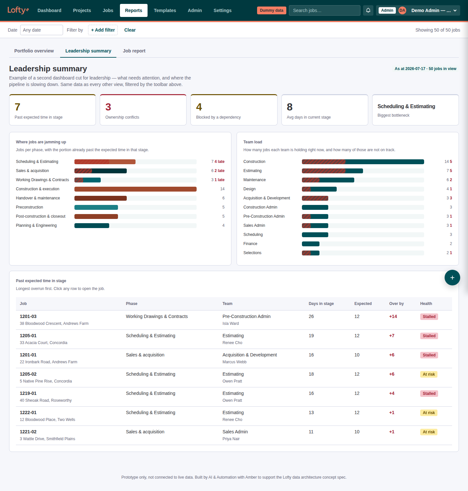

**Prototype.** The leadership tab's whole value is overrun analytics: "Past expected time
in stage" tile · "Biggest bottleneck" (named stage) · "Where jobs are jamming up" — bars
of jobs-per-phase with the late portion overlaid as a **red diagonal hatch on the same
left origin**, so late reads as a share of the total, not a second bar
(`index.html:9090-9206`, hatch CSS `:2028`) · team-load bars with the not-on-track share
hatched · an overrun table sorted by days-over, "+N" in red, rows clickable · an "As at
{date} · N jobs in view" chip so a screenshot of it is self-dating.

**App today.** Leadership tab has three tiles (in flight / teams holding / needing
attention) and a plain by-team bar list; "needing attention" counts statuses, not time.

**To implement (D → then B).** Every overrun figure needs `pipeline_stage_expected_days`
values, which are nullable with no default **by decision** — so this report lights up
per-stage as SLAs get set (G43), and must render honestly where they aren't ("no expected
duration set" — the app's Gantt already models this posture). The hatch-overlay bar and
the as-at chip are the two presentation ideas worth porting exactly.

```
Prototype: loftyprojectboard/index.html:9090-9206 (renderLeadershipDashboard), 1932-2050
           + 2028 (hatch CSS)
App today: app/src/pages/ReportsPage.tsx (Leadership summary tab)
```

**Update (rev 2).** The SLA spec is final (Q1): expected days **plus an at-risk lead**
per stage — which gives this report a band the prototype never had (approaching-due, not
just over). Class drops to C: lights up per stage as G43's editor gets values; still
renders honestly where none are set. Cancelled records are excluded from overrun figures
(lifecycle revision).

---

#### G37 · Printable job report — **A**

**Update (rev 3, 26 Aug): built.** A Print button on the Job report tab plus print CSS:
chrome, toolbar, tabs and the dock drop out; a print-only line states the date and how
many jobs the filters left in; rows avoid page breaks.

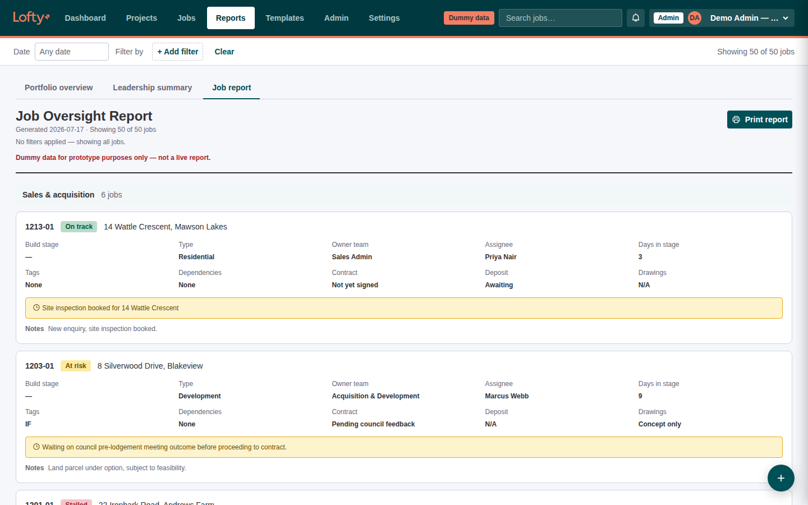

**Prototype.** The Job report tab is built to print: a report header stating generated
date, N of M shown, and **the filter sentence** (so a printed page says exactly which
subset it covers), a Print button → `window.print()`, per-stage sections, per-job cards
with `break-inside: avoid`, and an `@media print` block hiding the chrome
(`renderReport`, `index.html:9422-9490`; print CSS `:3206-3213`).

**App today.** The Job report tab is a plain table; no print affordance, no print styles
anywhere in the app. (There is also no CSV export in either — print was the prototype's
only export; if export matters it's a new decision, not a regression.)

**To implement.** A: print stylesheet for the reports route, the header block (reuse G9's
filter sentence), `break-inside` on row groups, a Print button. Cheap and immediately
useful the day real rows exist.

```
Prototype: loftyprojectboard/index.html:9422-9490 (renderReport), 3137-3213 (report + print CSS)
App today: app/src/pages/ReportsPage.tsx (Job report tab, plain table)
```

---

#### G38 · Clickable report rows — **A**

**Update (rev 3, 26 Aug): built** — attention and job-report rows open the job. The
same pass resolved two stale tokens: the report tables now show the real address and
assignee the board model has carried since PR #37/PR #39.

**Prototype.** Every report row/attention row opens the job's drawer.

**App today.** Reports rows are inert — the one table family in the app that doesn't
navigate (Jobs/Projects tables already do).

**To implement.** Same `row-clickable` treatment as `JobsPage`'s table →
`navigate('/jobs/'+jobNumber)`. Trivial.

```
Prototype: e.g. loftyprojectboard/index.html:9351-9370 (attention rows), 9097-9099 (lead table)
App today: app/src/pages/ReportsPage.tsx (all three tabs' tables)
```

### Settings

---

#### G39 · Working preferences — **A**

**Update (rev 3, 26 Aug): the A-half is built.** Landing page and default jobs view are
real (`data/preferences.ts`, localStorage — the theme's precedent), applied at the index
route and as `useBoardParams`' default; a link naming its own view still wins. The hint
owns up to device-local storage. The C-half — profile-roaming defaults, session view
state, user-saved views (Amber's Q9 layers) — still needs its preferences home.

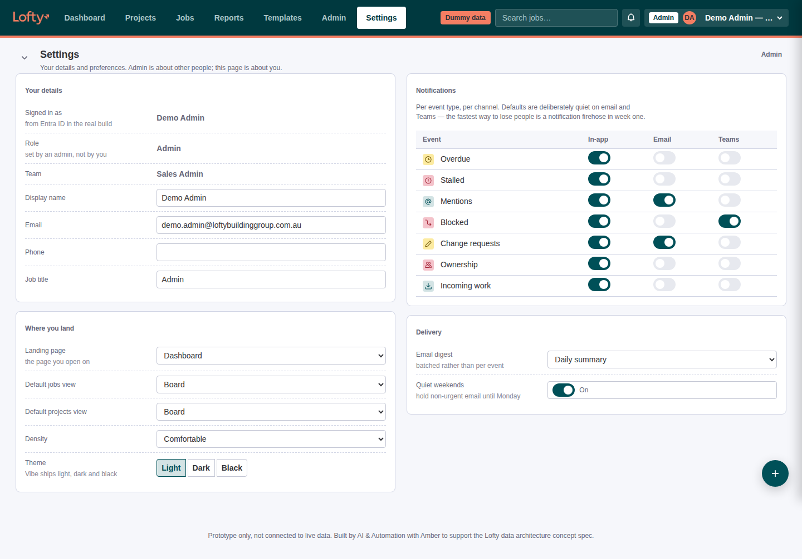

**Prototype.** Landing page, default jobs view, default projects view, density — stored
per user (though the prototype itself never read them back, `index.html:7605-7727`).

**App today.** "Landing page" and "Default jobs view" selects render **inert** —
hardcoded value, no-op onChange (`SettingsPage.tsx:94-107`).

**To implement.** Make them real or remove them; inert controls are the one thing this app
otherwise refuses to ship. Persistence: `localStorage` matches the app's existing
precedent (theme, nav-collapsed) and needs no schema; profile-table columns make them
roam. Recommend `localStorage` now (a preferences JSON blob column later if roaming
matters — that's an "anything that becomes a property, any time" change per
`HANDOFF.md:1022-1032`). Landing page applies at the `/` index route; default view feeds
`useBoardParams`' default.

```
Prototype: loftyprojectboard/index.html:7570-7727 (settingsFor, renderSettingsPage)
App today: app/src/pages/SettingsPage.tsx:94-107 (inert selects); theme persistence
           precedent at app/src/App.tsx:84-96
```

**Update (rev 2): the scope grew.** Amber (Q9) wants three layers, so the localStorage
recommendation above is superseded:
1. **Profile-backed defaults** — landing page and default views roam: log in anywhere,
   land on your preferences. That's a preferences home on the profile (a column or small
   table), not localStorage.
2. **Session-persistent view state** — change board→table or set a filter, switch pages,
   come back: the choice holds. The URL already carries this state (`useBoardParams`);
   what's needed is remembering the last board query string per session and re-applying
   it on return.
3. **User-saved views** — beyond the three fixed tabs (`savedViews.ts`): users save a
   named view (view + grouping + filters). Needs a `saved_views` table (owner, name,
   query state) + RLS, and the tabs component grows a user section.
Class becomes A (wire the selects to the store) + C (the preferences/saved-views tables).

---

#### G40 · Notification matrix persistence — **C + D**

**Update (rev 3, 26 Aug): the matrix saves.** Toggles persist per device
(`preferences.ts`), defaults staying deliberately quiet, and the panel owns up:
delivery starts when notifications are built — in-app first (Q4), Teams/email later.
Recording the choices now means nobody re-answers seven questions at rollout.

**Prototype.** Seven event types × three channels (In-app / Email / Teams) as toggles,
with deliberately quiet defaults — email only for mentions and change requests, Teams only
for blocked ("the fastest way to lose people is a notification firehose in week one"),
plus digest frequency and quiet-weekends (`index.html:7566-7593`).

**App today.** The same matrix renders with uncontrolled, unpersisted toggles
(`SettingsPage.tsx:18-26, 133-140`) — decoration.

**To implement.** Meaningless until notifications exist (G1): the toggles' *storage* is a
`notification_prefs` shape written with G1's schema; the quiet defaults are the part worth
keeping verbatim. Until then the matrix should either say it's not live or come out —
same honesty rule as G39.

```
Prototype: loftyprojectboard/index.html:7566-7593 (types, channels, defaults)
App today: app/src/pages/SettingsPage.tsx:18-26, 133-140 (uncontrolled toggles)
```

**Update (rev 2).** Channels decided (Q4): in-app (dashboard + bell) this phase, Teams
and email later. Until those channels exist the matrix should show only the in-app
column — or say the rest isn't live yet. The quiet defaults still apply when email/Teams
arrive.

### Templates, Setup, Admin

---

#### G41 · Template / milestone editing — **D**

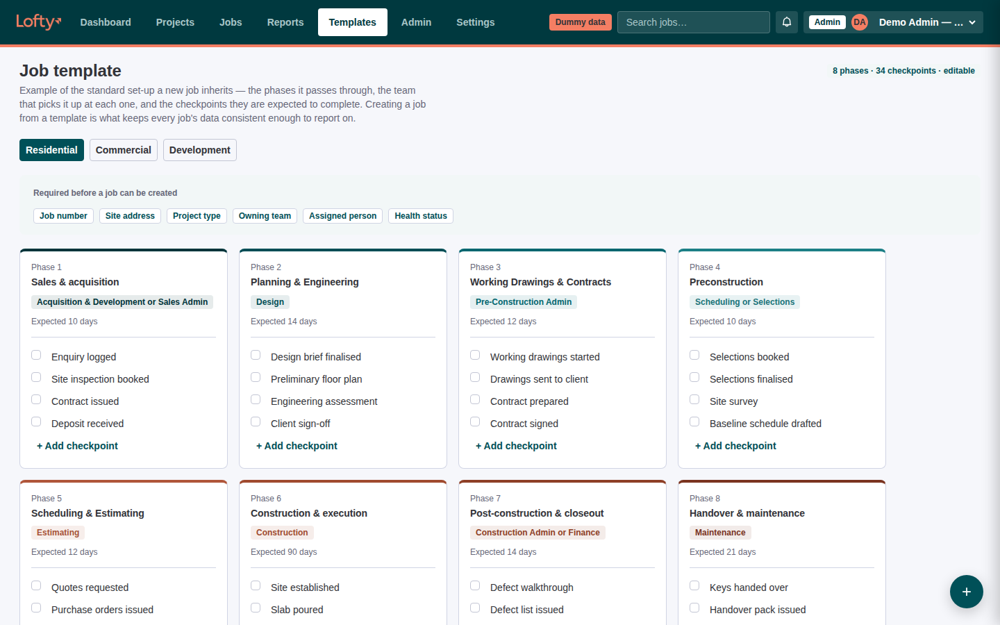

**Prototype.** Per-type templates (Residential/Commercial/Development toggles; Development
skips a phase, and the page says so), a required-fields block, and **in-place milestone
editing** for admins — borderless inputs, hover-revealed remove, add button, empty value
deletes; edits immediately affect the new-job preview (`renderJobTemplate`,
`index.html:9256-9322`; editing `:9236-9254`).

**App today.** Templates page is honest and read-only: real phases from the database, "No
owning team set" / "No expected duration set" / "None defined yet." throughout; the
type chips were made `readOnly` because they filtered nothing (`TemplatesPage.tsx:59-70`).

**To implement (D).** Same blocker as G22 — milestones have no home until the process
decision. When steps become dated properties, "template editing" becomes property-
definition management (G42) plus per-type applicability; the prototype's inline-edit
interaction ports to whatever that screen is. Do not build a milestone editor for a table
that isn't the chosen model.

```
Prototype: loftyprojectboard/index.html:9212-9322 (template data + page + editing)
App today: app/src/pages/TemplatesPage.tsx (read-only, honest empties)
```

---

#### G42 · Property-definition editing — **C**

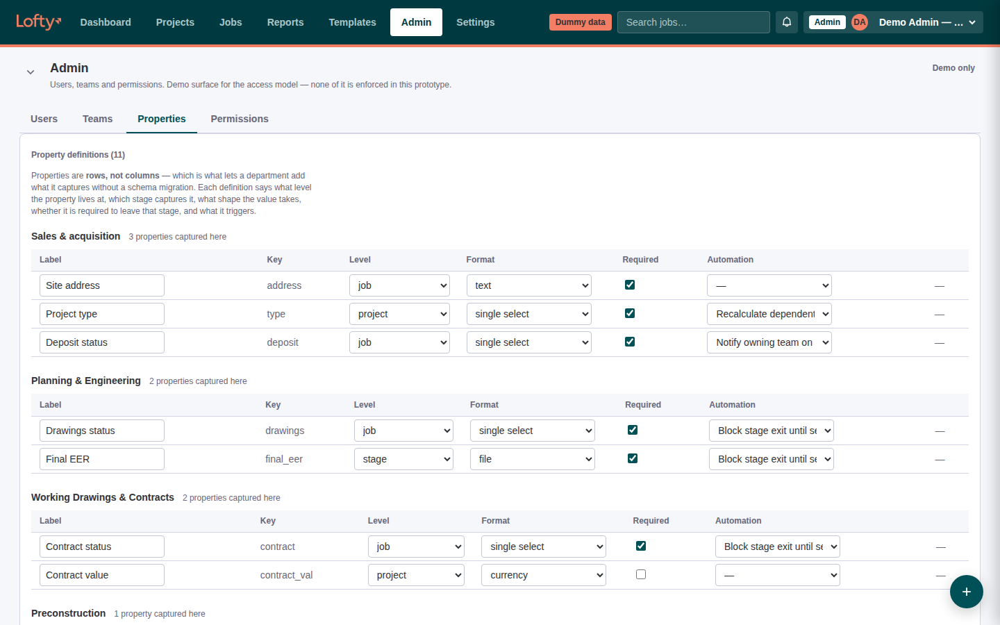

**Prototype.** Property definitions as editable rows grouped by capture stage: label, key,
level (project/job/stage), format (9 formats), required, automation (7 automations),
add/remove (`index.html:7931-7984`). The whole "properties are rows, not columns"
argument made concrete.

**App today.** Setup → Properties renders the same *shape* read-only and says plainly
"Nothing defined yet. `property_defs` is not built" (`SetupPage.tsx:87-147`). Setup →
Automations: "Not built yet." (`SetupPage.tsx:72-85`).

**To implement (C).** Phase C builds `property_defs` (seeded from the real eleven, then
the ~126); the editing UI follows, permission-gated **superadmin-only for
create/change-property** per the ladder (`schema-plan.md:151-159` — admin explicitly
cannot). The prototype's format/automation vocabularies were reasonable drafts; the real
lists come from Phase C decisions (`HANDOFF.md:1239-1253`). Board-filterable things stay
real columns — the doc'd constraint "the board cannot cheaply filter or sort on a
property" (`HANDOFF.md:1116-1179`) bounds what this screen may create.

```
Prototype: loftyprojectboard/index.html:7741-7984 (formats, scopes, automations, tab)
App today: app/src/pages/SetupPage.tsx:87-147 (read-only Properties), :72-85 (Automations)
```

**Update (rev 2): largely built.** `property_defs` is a real table (`0043`) and Setup →
Properties now **creates, deletes, and toggles required** — add form with auto-slugged
key, level, capture stage, team, format, automation (`SetupPage.tsx:109-350`),
superadmin-gated in the app and by policy, shipping empty by design. Remaining: a general
edit form (`updatePropertyDef` supports every field but the UI only edits `required`,
`SetupPage.tsx:320-328`); archive-instead-of-delete is worth considering once real
definitions accumulate; and the value side is G17's `property_values`. The board-filter
bound still applies to what this screen may create.

---

#### G43 · Stage SLA editor (in Setup → Automations, per rev 2) — **A**

**Prototype.** Expected days per phase were hardcoded constants — superseded as data, but
they powered every overdue/overrun feature (G1, G13, G33, G36).

**App today.** `pipeline_stage_expected_days` exists, nullable, no default — and **no
screen edits it**; HANDOFF explicitly notes the missing screen: "Setup → Process,
alongside a stage editor — neither exists" (`HANDOFF.md:1065-1078`).

**To implement (A).** The one gap HANDOFF itself asks for: a Setup → Process section
listing pipelines and stages with an editable expected-days field (blank = no limit, per
the answered decision — never default it), manager/admin-gated with matching RLS, writing
through a new repository method. This is also the **unlock for the entire overdue family**
— cheap, and everything in G1/G33/G36 waits on values existing here.

```
Prototype: loftyprojectboard/index.html:9079-9088 (PHASE_EXPECTED_DAYS — superseded as data)
App today: no editor; values read via app/src/data/useLookups.ts (expectedDaysByStage —
           absent-not-zero rule at useLookups.ts:56-62); Setup shell at app/src/pages/SetupPage.tsx
```

**Update (rev 2): the spec is final** (Q1), and its home moved — the SLA editor lives in
the **Automations screen** (Setup → Automations, currently "Not built yet."), not a new
Process section. Per stage: the stage name, **expected days in stage**, and an **at-risk
lead** (days before due at which the job flags at-risk); overdue = in the stage longer
than the set days; blank = no limit, never defaulted. That's one more column than the
schema holds today (`pipeline_stage_expected_days` exists; the at-risk lead needs a
sibling, e.g. `pipeline_stage_at_risk_days`) — a small migration, then the editor. Still
class A-adjacent and still the unlock for G1, G13, G33 and G36; the lifecycle revision
adds one rule: SLA clocks don't run on cancelled records.

---

#### G44 · Team management UI — **A**

**Update (rev 3, 26 Aug): largely built.** Admin → Teams renames (the slug never
changes, so nothing breaks) and retires/restores — retire is a flag, per the 0026
no-DELETE policy — with the jobs-held guard disabling retirement until jobs are handed
on; retired teams stay listed, dimmed, so they can be restored. Members and jobs-held are
real. **Creating a new team is deferred**: the app's `TeamId` union is closed over the
seeded slugs (and `verify/seeds.sh` asserts stub and database agree), so create-team
needs that type opened and the seed-check contract revisited — flagged, not fudged.

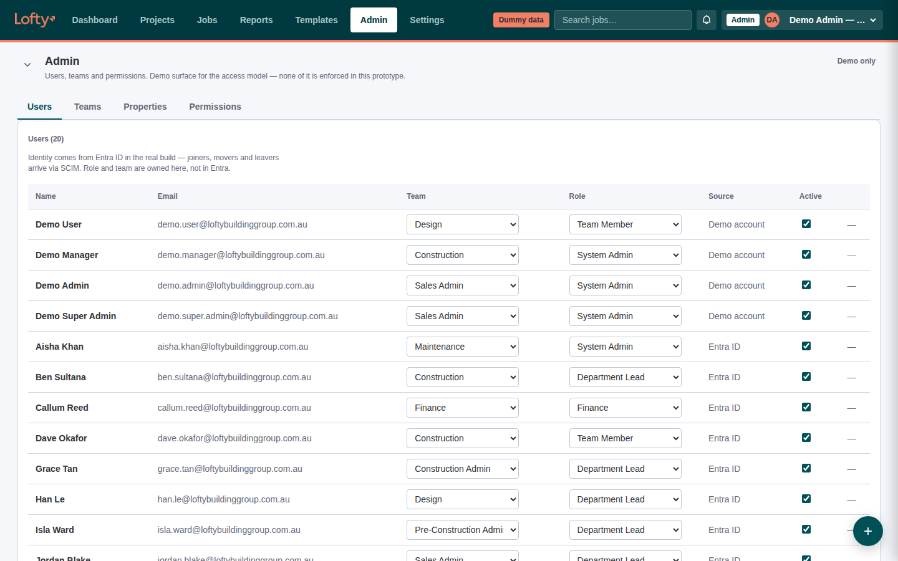

**Prototype.** Teams tab: members, phases owned, jobs held, not-on-track count, and
**remove with a guard** — a team still holding jobs refuses deletion with "reassign them
before removing the team" (`deleteTeam`, `index.html:7867-7878`).

**App today.** Admin → Teams is a read-only table (with a Members token column), even
though `teams` is a lookup **table** — and HANDOFF records Amber asking for exactly this:
add/edit enum-ish values from the app "works for `teams` (a table), impossible for the
remaining enums without DDL" (`HANDOFF.md:82-90`).

**To implement (A).** Create/rename/deactivate teams (deactivate, not delete — the app's
nobody-is-ever-deleted posture from profiles applies; the prototype's jobs-held guard
becomes "can't deactivate while holding jobs"), manager-of-that-team/admin gated + RLS.
Members column becomes real via `profile_teams` (already read for user editing —
`TeamPicker` writes it, so the read exists). Use the existing `CreatePanel` + `UserRow`
inline-edit idioms.

```
Prototype: loftyprojectboard/index.html:7985-8016 (teams tab), 7867-7878 (guarded delete)
App today: app/src/pages/AdminPage.tsx:241-303 (read-only Teams tab); membership editing
           already in app/src/components/UserDialogs.tsx (TeamPicker)
```

---

#### G45 · Permissions matrix, real — **C**

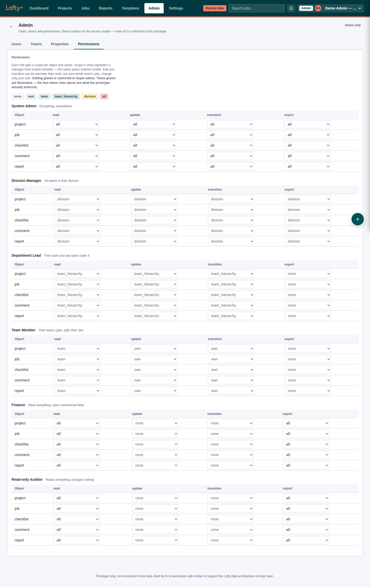

**Prototype.** Per-role grant grids (objects × actions, every cell a scope select) with a
**scope heat-scale** — cells colour from grey (`none`) through teals to amber and **red
for `all`**, so anything wider than expected jumps out (`index.html:8017-8053`, colours
`:866-873`). Illustrative only — the grid drove nothing.

**App today.** Admin → Permissions renders the grid shape with every cell a
`{{permission_grants.action}}` token (`AdminPage.tsx:311-343`).

**To implement (C).** `permission_grants` is Phase C, and its shape is decided differently
from the prototype (per-property grants layered on the ladder, resolution order
bypass → manager-not-restricted → grant → baseline → deny, `schema-plan.md:985-988`;
viewer scope parked, `HANDOFF.md:1206-1227`). When built, render the *actual* resolution
model — and keep the heat-scale idea: colour by effective breadth so an over-wide grant is
visible at a glance. Do not port the six-role grid.

```
Prototype: loftyprojectboard/index.html:8017-8053 (grid), 866-873 (heat scale)
App today: app/src/pages/AdminPage.tsx:311-343 (token grid)
```

### Cross-cutting

---

#### G46 · Date-range filter — **C**

**Update (rev 3, 26 Aug): real, on the one date every job carries.** The Date select
filters on when a job entered its current stage — "Moved stage in last 7/30 days / this
month", labels saying the semantics out loud — riding the same filters array as the
chips, so it lands in the URL (`?date=7d`) and the Showing count. Latest-activity and
dated-property ranges can widen it later; the inert select is gone.

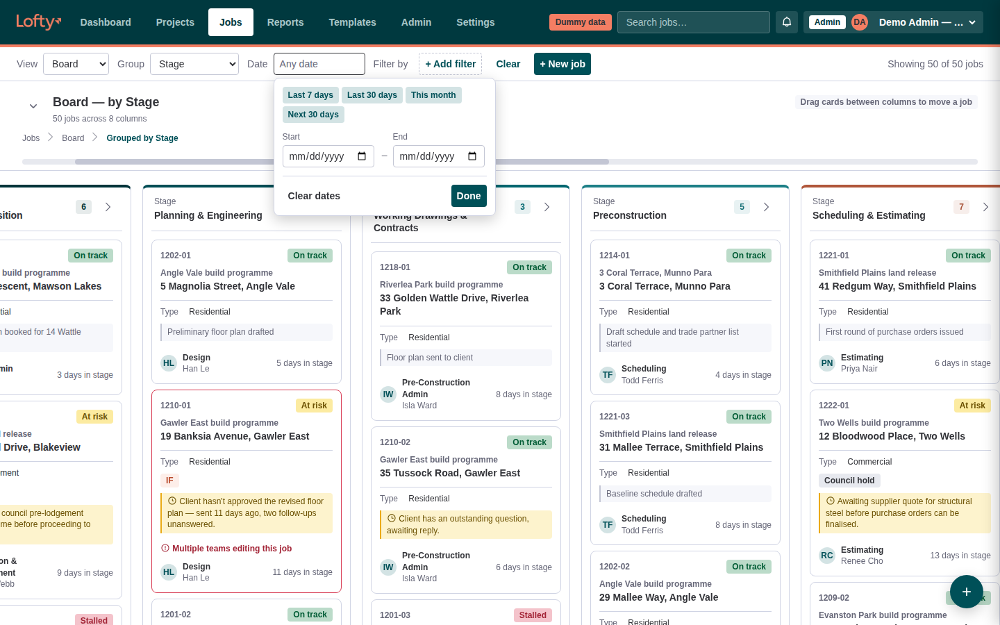

**Prototype.** A working date filter: trigger showing "Any date" / "Jul 1 – Jul 17" /
"From…" / "Until…", a popover with four presets (Last 7/30 days, This month, Next 30
days), start/end date inputs that auto-correct inverted ranges, Clear/Done
(`index.html:6406-6492`). Jobs filter on latest-activity date; projects on window overlap.

**App today.** The Date select renders **fully inert** — `value={null}, onChange: no-op`
(`Toolbar.tsx:104-111`).

**To implement (C).** Blocked on having a date to filter by: job activity dates (G18) or
dated step-properties (G22). When one exists: Vibe `DatePicker mode="range"` replaces the
hand-built popover (`react-migration.md:284-290` names this upgrade), presets kept, range
in the URL via `useBoardParams` (keys can be added; the pattern already reserves unused
keys). Until then, the inert select should say so or come out — same rule as G39.

```
Prototype: loftyprojectboard/index.html:6406-6492 (popover, presets, summary), 6518-6526
           (job matching), 8093-8099 (project overlap)
App today: app/src/components/Toolbar.tsx:104-111 (inert select);
           app/src/data/useBoardParams.ts (URL state to extend)
```

**Update (rev 2).** Comments now give every job and project a real dated event
(`comment_created_at`), so "filter by latest activity date" finally has a source — the
first workable basis for making the Date control real. Dated step-properties remain the
richer source later.

---

#### G47 · Additional filter fields — **C**

**Update (rev 3, 26 Aug): Type is back.** The project's type rides every job through
`job_display`, so the Type filter narrows for real on all three list pages — enum as the
value, labels free to change. Tag still waits on tag wiring; there is deliberately no
Team-member filter (the Team filter matches membership). The same pass fixed the empty
state: filters that empty a view now say "no jobs match the current filters" instead of
blaming a search nobody typed.

**Prototype.** Seven filters: type, stage, status, team, team member (jobs/reports);
manager, division (projects) — with per-page validity and silent cleanup of stale keys
(`FILTER_DEFS`, `index.html:6283-6321`; chips `:6375-6404`).

**App today.** Three: Stage, Team, Status — deliberately, with the reasoning in place:
"'Team member', 'Type' and 'Tag' were on this list and are not any more. Nothing on a job
holds them yet… Put each back the moment its column exists" (`Toolbar.tsx:22-30`).
`useBoardParams` already reserves `member/type/tag` query keys.

**To implement.** Exactly what the comment says: Team member returns with the assignee
model; Type returns as a *project*-type filter applied through the parent (and on the
Projects page directly); Tag with G6's tag wiring. Manager and Division do not return
(§1.3). The chip mechanics themselves (unset-on-add so adding never empties the view,
`.is-set` styling, per-page validity) are already implemented in the app's `Toolbar` —
this gap is fields, not mechanics.

```
Prototype: loftyprojectboard/index.html:6283-6321 (FILTER_DEFS)
App today: app/src/components/Toolbar.tsx:22-30 (FILTERABLE + rationale);
           app/src/data/useBoardParams.ts (reserved keys); app/src/data/filtering.ts
```

**Update (rev 2).** The Team-member filter's blocker is resolved on paper: Q2 gives jobs
an assignee team + user. Once those columns land, "put each back the moment its column
exists" fires for `member` — and the assignee-*team* property also means the existing Team
filter should be checked against which team field it filters (owning vs assignee).

**Update (rev 3, 26 Aug): the Team filter question is answered and implemented.** Amber:
it "should just read 'team', and anyone who owns a job, if they are in that team (even if
they have multiple teams), it should show." So there is one Team filter and no separate
person filter: a job matches Design when Design owns it **or** its assignee sits in
Design (`filtering.ts`, via `BoardJob.assigneeTeams`). Team-member *grouping* also works
now — `job_assignee_id` existed since 0028 and `boardModel` resolves it, so grouping
shows real names with an honest "Unassigned" column.

---

#### G48 · Live-region announcements — **A**

**Update (rev 3, 26 Aug): built** — the toolbar's "Showing N of M" is mirrored into a
visually-hidden `role=status` region, so filtering is no longer silent to a screen
reader.

**Prototype.** A visually-hidden `role=status` live region announced "{N} of {M} jobs
shown. {filter description}" on every render, debounced 120ms — filtering was previously
silent to a screen reader (`announce`, `index.html:10818-10823`, called at `:6713-6715`).

**App today.** No live region for result counts; the app's a11y is otherwise strong (skip
link, aria-sort, focus management).

**To implement.** A small `aria-live=polite` element in the shell fed by the same state as
"Showing N of M" + the G9 filter sentence. Debounce it; announce on filter/search/view
changes only.

```
Prototype: loftyprojectboard/index.html:10818-10823 (announce), 4824 (live region element)
App today: absent; count state at app/src/pages/JobsPage.tsx + Toolbar count prop
```

---

## 3. What the app has that the prototype lacks

Porting must not regress these — several are direct fixes of prototype problems:

- **URLs for everything** — jobs, projects, board state, saved view, Setup tabs are all
  linkable; the prototype had zero routing ("today nothing in this app is linkable",
  `react-migration.md:315-316`). Every new surface above must join the URL, not bypass it.
- **Real auth, profiles, and RLS** — Entra sign-in, profile linking, the not-set-up
  screen, and 70 policies; the prototype's roles were a header dropdown.
- **Honesty about absent data** — `{{table.column}}` tokens, dashed unbound cards, empty
  states that explain (`NothingYet`/`NoResults`/`LoadProblem`), verbatim error surfaces.
  The prototype showed 50 invented jobs; the app deleted its own invented data on purpose.
- **Saved-view tabs** (All / Live / Closed) as real anchors with counts.
- **Sortable tables** with `aria-sort`, blanks-last, ladder-aware ordering — something the
  prototype never had anywhere.
- **Inline row editing with change-only patches** and an activity/audit trail on profiles.
- **The dictionary and wiring pages** — 206 documented properties and a live map of what
  reads from Supabase.
- **A responsive shell** — collapsible rail becoming a drawer below 900px, a five-width
  zero-overflow sweep (`npm run responsive`); the prototype was desktop-only.
- **Vibe as real React components** with the documented gotcha list (`HANDOFF.md:1330-1362`)
  — not 4,700 lines of lookalike CSS.
- **Search that knows about address history** — matches on original addresses with a
  notice.
- **(rev 2) Stage moves done properly** — a confirmation naming from→to with a
  phase-skip warning, forwards-only and manager+ enforced *in the database* by trigger,
  and a picker that doubles as the keyboard path. The prototype's drag just moved the
  card. Also: address history with a visible timeline, dictionary overrides, and a
  project stage that follows its slowest job by trigger — none of which the prototype
  modelled.

## 4. Suggested implementation order

Respecting HANDOFF's sequencing (spine → import → presentation) and the one-branch-per-
concern convention. Within each package, items are independent branches.

**Package 1 — polish that needs nothing (A), any time:**
G2 toasts · G3 tooltips · G9 view header + filter sentence · G10 top scrollbar ·
G12 table sorting · G15 drawer fullscreen/tabs (shell) · G19 drawer search ·
G20 drawer polish + focus-bug fix · G32 create preview · G37 print report ·
G38 clickable report rows · G48 live region · G4 search polish.
Each is small, none touches schema, all are visible wins the day real data lands.

**Package 2 — small wiring with outsized payoff:**
G26's `boardModel` project-address join (kills the largest token population in one fix) ·
G43 the SLA editor (unlocks the whole overdue family) · G44 team management (already
requested) · G39 make-or-remove the inert Settings selects.

**Package 3 — after the spine review + Phase B, designed against real rows (B):**
G5 re-cut phase ramp (+G35) · G6's A-parts (project line, days on card) · G7 drag-and-drop
· G8 drill-downs · G11 empty-column decision · G28 project gantt/calendar ·
G13 job Gantt (last — biggest unknown) · G33's tiles as their inputs arrive.

**Package 4 — as Phase C tables land (C):**
G16 job editing (+RLS) → G18 feed/comments → G6 tags/dependencies on cards → G46 date
filter → G47 filter fields → G17/G42 properties → G45 permissions grid → G24 job-file
links → G27 remaining columns → G29 project editing → G34 KPI tiles.

**Package 5 — after their decisions (D):**
G1+G40 notifications · G21 departments/handoff · G22 checklists · G23 AI dock ·
G25 change requests · G30 push-to-jobs · G31 creation flow · G36 leadership analytics ·
G41 template editing.

**Rev 2 restatement.** PR #37 and the answers emptied or moved several packages, so the
order now reads:

- **Done since rev 1:** G26's address join · G7 drag-and-drop · G29 project editing ·
  G42 property definitions (largely) · G18's comment half · G11 (decision: closed).
- **P2 (small wiring, outsized payoff) becomes:** G43 the SLA editor — now fully specified
  (Q1) with one small migration for the at-risk lead column, still **the single highest-
  leverage unbuilt item** · G44 teams UI · G24 job folder links (now UI-only) · G39's
  select wiring · the **lifecycle revision** (Completed/Closed/Cancelled + the
  cancelled-revival carve-out) — spine-level, so it belongs *before* Phase B and before
  more forwards-only machinery accretes.
- **New schema queue from the answers:** assignee team + user on jobs and projects with
  the auto-assign-to-Acquisition-&-Development default (Q2) · preference storage and a
  `saved_views` table (Q9) · the at-risk lead column (Q1). All "anything that becomes a
  property — any time" changes.
- **P3 (after Phase B)** unchanged: ramp, card content, drill-downs, project gantt,
  job gantt last. **P4/P5** as above, minus what moved.

## 5. Questions for Amber — answered 25 Aug 2026

All ten were answered the day this document shipped; the full decisions are recorded in
§1.6 and folded into the entries. In brief (✅ = settled, ◐ = settled in principle,
details still owed):

1. ✅ **At-risk / overdue** — per-stage SLA in the Automations screen: expected days +
   an at-risk lead; overdue = past expected. (G43 spec final.)
2. ✅ **Assignment** — assignee team + user columns on jobs *and* projects, editable;
   auto-assigned to Acquisition & Development on creation.
3. ✅ **AI dock** — survives.
4. ✅ **Notifications** — this phase, in-app (dashboard + bell); Teams/email later.
5. ✅ **Drag-and-drop** — "yes definitely" (and it shipped the same day, PR #37).
6. ◐ **Single-job creation** — variations will exist; mechanism TBC.
7. ◐ **Push project→jobs** — applies to creation-set properties; exact field list TBC.
8. ◐ **Waiting-on / change requests** — yes, modelled inside the variation request;
   details TBC, "very important to keep".
9. ✅ **Preferences** — profile-backed defaults + session-persistent view state +
   user-saved views. (G39 scope grew accordingly.)
10. ✅ **Empty columns** — keep them visible.

**Still owed (the new open list):**
- The **variation model** — it now carries three features (single-job creation, waiting-on
  /change requests, and part of push): what a variation is, who raises it, what it blocks.
- The **lifecycle revision details** (§1.6): exact position list (Completed / Closed /
  Cancelled alongside today's five), the 12-month Completed→Closed automation, the
  cancelled-revival carve-out in the forwards-only guards — and logging the reversal in
  `schema-plan.md` (it currently records "cancellation is a status, not a phase").
- Whether the existing **Team filter** should read owning team, assignee team, or offer
  both once Q2's columns land (G47).
- `HANDOFF.md` needs its PR #37 session note — it currently describes the app as it was
  before stage moves, comments, property_defs and project editing existed.

---

## Appendix A — file maps

### A.1 The prototype (`loftyprojectboard/index.html`, 10,903 lines)

| Region | Lines | What's there |
|---|---|---|
| Original stylesheet | 13–3213 | First-pass bespoke CSS — **largely overridden; do not implement from this range** |
| Vibe component layer | 3215–4176 | The overriding restyle: buttons, labels, chips, cards, toolbar — **the authoritative visual values** |
| Vibe catalog | 4178–4708 | Component builds (toggle, toast, tooltip, banner, skeleton…), theme overrides |
| Markup | 4711–4841 | Header, nav, toolbar, 15 view containers, modals, drawer, dock shells |
| Icons + helpers | 4851–4946 | 67 Vibe icon paths, `vibeIcon()` |
| Data | 4947–5654 | 8 stages, 50 seeded jobs |
| Derivations & accents | 5656–6065 | initials, status labels, colour ramps, `buildProjects`, department maps |
| Roles & scoping | 6089–6258 | capabilities, `can()`, `scopedJobs`, user switcher |
| Filters & search | 6262–6528 | `jobMatchesQuery`, `FILTER_DEFS`, chips, date range, `getVisibleJobs` |
| Top scrollbar | 6535–6643 | `attachTopScroll` |
| Router & shell | 6650–6847 | `setPage`, `renderPage`, view header |
| Board & drill-downs | 6849–7257 | `renderKanban`, drag-drop, `openGroupDrilldown`, scheduling variant, `renderTable` |
| New job & template preview | 7259–7451 | modal, `createJobFromTemplate` |
| AI answers | 7459–7560 | job facts, keyword routing, `askAboutJob` |
| Settings | 7563–7727 | per-user settings, notification matrix |
| Admin | 7730–8070 | users, teams, property defs, permission grid |
| Projects | 8075–8666 | visibility, cards/list/gantt, detail, push modal, new project |
| AI dock & portfolio answers | 8672–8797 | `answerGeneralQuestion`, `renderAiDock` |
| Notifications | 8799–8918 | types, `buildNotifications`, panel |
| Personal dashboard | 8922–9070 | `renderUserDashboard` |
| Leadership report | 9073–9206 | overruns, bottlenecks |
| Templates page | 9212–9322 | checkpoints, skips, editing |
| Portfolio report | 9324–9420 | KPIs, bars, `describeActiveFilters` |
| Job report | 9422–9490 | printable cut |
| Calendar | 9495–9661 | grid, job + project variants |
| Job gantt | 9677–9895 | duration model, `renderGantt`, dependency SVG |
| Drawer | 9897–10680 | `openDrawer`, tabs, write path, checklists, feed, search |
| Toast/tooltip/a11y runtime | 10683–10900 | `vibeToast`, tooltips, live region, focus trap, keyboard retrofit |

### A.2 The app (`app/src/`)

| File | Role |
|---|---|
| `App.tsx` | Routes, auth gate, theme state |
| `shell/AppShell.tsx` `.css` | Rail, header, search box, user menu, footer, responsive drawer |
| `theme/loftyTheme.ts`, `theme/tokens.css` | Vibe brand tokens per mode; orange/inks/header colours |
| `pages/DashboardPage.tsx` | Static personal dashboard (G33) |
| `pages/JobsPage.tsx` | Saved views, toolbar, grouping, Board/Table/Gantt/Calendar (G5–G14) |
| `pages/ProjectsPage.tsx` | List + detail (G26–G29) |
| `pages/ReportsPage.tsx` | Three report tabs (G34–G38) |
| `pages/TemplatesPage.tsx` | Read-only phase cards (G41) |
| `pages/AdminPage.tsx` | Users / Teams / Permissions (G44, G45) |
| `pages/SetupPage.tsx` | Properties / Dictionary / Wiring / Automations (G42) |
| `pages/DictionaryPage.tsx`, `pages/WiringPage.tsx` | The app-only documentation surfaces |
| `pages/SettingsPage.tsx` | Details, prefs (G39), theme, notification matrix (G40) |
| `pages/SignInPage.tsx`, `NotSetUpPage.tsx`, `LegalPage.tsx` | Auth edges |
| `components/JobDrawer.tsx` | The job panel (G15–G25) |
| `components/RecordCards.tsx` | StatusPill, JobCard, ProjectCard (G6, G26) |
| `components/Toolbar.tsx` | View/Group/Date/filter chips (G46, G47) |
| `components/SavedViewTabs.tsx` | Pipeline-slice tabs |
| `components/CreatePanel.tsx`, `CreateDialogs.tsx` | Create flows incl. dormant NewJobDialog (G31, G32) |
| `components/UserRow.tsx`, `UserDialogs.tsx` | Inline editing + dialogs — the editing idiom to copy |
| `components/SortableTable.tsx` | `useTableSort` — reuse for G12/G27 |
| `components/PropertySlots.tsx` | Definition-driven field slots (G17) |
| `components/SearchNotices.tsx`, `Token.tsx`, `Form.tsx`, `Select.tsx` | Empty states, tokens, form primitives |
| `components/ui.css` | All shared visual rules (~920 lines) |
| `data/repository.ts` | **The seam** — every new read/write above starts here |
| `data/supabaseRepository.ts` | Wiring + the `[]` returns for absent tables |
| `data/boardModel.ts` | `BoardJob`/`BoardProject` joins (G26's fix) |
| `data/useBoardParams.ts` | URL ⇄ board state (extend for drills, dates, new filters) |
| `data/useLookups.ts` | Stages, teams, SLAs (absent-not-zero), team labels (null-not-slug) |
| `data/SearchProvider.tsx`, `filtering.ts`, `savedViews.ts` | Search + filter mechanics |
| `data/types.ts`, `dictionary.ts` | Domain model; 206 documented properties |

### A.3 Screenshot index

All in `docs/comparison-screenshots/`, prototype at 1440×900, Demo Admin unless noted:
`dashboard-personal` (as Priya Nair, team member — note the role-narrowed nav) ·
`board-by-stage` · `job-card-closeup` · `toolbar-filters-set` · `daterange-popover` ·
`drilldown-column` · `drilldown-scheduling` · `table-view` · `gantt-view` ·
`calendar-view` · `drawer-docked` · `drawer-fullscreen-main` ·
`drawer-fullscreen-properties` · `drawer-fullscreen-activity` ·
`drawer-fullscreen-departments` · `drawer-scheduling-checklists` ·
`drawer-search-results` · `projects-cards` · `projects-table` · `projects-gantt` ·
`project-detail` · `push-modal` · `new-job-modal` · `reports-portfolio` ·
`reports-leadership` · `reports-job-report` · `templates` · `admin-users` ·
`admin-properties` · `admin-permissions` · `settings` · `notifications-panel` · `ai-dock`.
